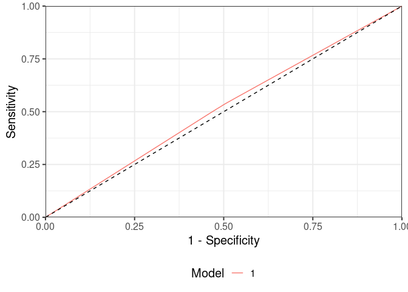
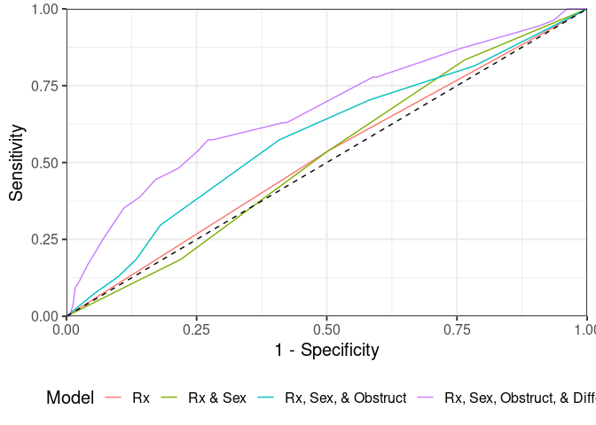

# Vignette: Diagnostic / Prognostic Accuracy

## Load data

## Load data

Firstly let’s re-load our example data (the `survival::colon`)

    data <- tibble::as_tibble(survival::colon) %>%
      dplyr::filter(etype==2) %>% # Outcome of interest is death
      dplyr::filter(rx!="Obs") %>%  # rx will be our binary treatment variable
      dplyr::select(-etype,-study, -status) %>% # Remove superfluous variables
      
      # Convert into numeric and factor variables
      dplyr::mutate_at(vars(obstruct, perfor, adhere, node4), function(x){factor(x, levels=c(0,1), labels = c("No", "Yes"))}) %>%
      dplyr::mutate(rx = factor(rx),
                    mort365 = cut(time, breaks = c(-Inf, 365, Inf), labels = c("Yes", "No")),
                    mort365 = factor(mort365, levels = c("No", "Yes")),
                    sex = factor(sex, levels=c(0,1), labels = c("Female", "Male")),
                    differ = factor(differ, levels = c(1,2,3), labels = c("Well", "Moderate", "Poor")),
                    extent = factor(extent, levels = c(1,2,3, 4), labels = c("Submucosa", "Muscle", "Serosa", "Contiguous Structures")),
                    surg = factor(surg, levels = c(0,1), labels = c("Short", "Long")))

Now lets create our model fit (`fit1`) and derive our predictions based
on our model (`predict1`).

We are starting with a very simple model trying to predict deatn at 1
year (“mort365”) using just 1 variable (“rx” aka treatment receieved).

    fit1 <- finalfit::glmmulti(data, dependent = "mort365", explanatory = c("rx"))

    predict1 <- predictr(data = data, fit = fit1)

## Comparing accuracy across a predictive model

### Receiver Operating Characteristic (ROC) curves

One of the most common ways to visualise the performance of the model is
using Receiver Operating Characteristic (ROC) curves. This involves
plotting the sensitivity and specificity of the model against one
another.

There are 2 steps required to make these using `predictr`:

#### 1). `roc_plot_format()`

This function takes the predictions from the `predictr()` function
output, and provides a tibble of the sensitivity and specificity of the
model required for plotting.

    roc_format1 <- predict1 %>%
      roc_plot_format(event = "event", predict = "predict_prop",confint = T, smooth=T)

    ##   |                                                              |                                                      |   0%  |                                                              |                                                      |   1%  |                                                              |=                                                     |   1%  |                                                              |=                                                     |   2%  |                                                              |=                                                     |   3%  |                                                              |==                                                    |   3%  |                                                              |==                                                    |   4%  |                                                              |==                                                    |   5%  |                                                              |===                                                   |   5%  |                                                              |===                                                   |   6%  |                                                              |====                                                  |   6%  |                                                              |====                                                  |   7%  |                                                              |====                                                  |   8%  |                                                              |=====                                                 |   8%  |                                                              |=====                                                 |   9%  |                                                              |=====                                                 |  10%  |                                                              |======                                                |  10%  |                                                              |======                                                |  11%  |                                                              |======                                                |  12%  |                                                              |=======                                               |  12%  |                                                              |=======                                               |  13%  |                                                              |=======                                               |  14%  |                                                              |========                                              |  14%  |                                                              |========                                              |  15%  |                                                              |========                                              |  16%  |                                                              |=========                                             |  16%  |                                                              |=========                                             |  17%  |                                                              |=========                                             |  18%  |                                                              |==========                                            |  18%  |                                                              |==========                                            |  19%  |                                                              |===========                                           |  19%  |                                                              |===========                                           |  20%  |                                                              |===========                                           |  21%  |                                                              |============                                          |  21%  |                                                              |============                                          |  22%  |                                                              |============                                          |  23%  |                                                              |=============                                         |  23%  |                                                              |=============                                         |  24%  |                                                              |=============                                         |  25%  |                                                              |==============                                        |  25%  |                                                              |==============                                        |  26%  |                                                              |==============                                        |  27%  |                                                              |===============                                       |  27%  |                                                              |===============                                       |  28%  |                                                              |===============                                       |  29%  |                                                              |================                                      |  29%  |                                                              |================                                      |  30%  |                                                              |================                                      |  31%  |                                                              |=================                                     |  31%  |                                                              |=================                                     |  32%  |                                                              |==================                                    |  32%  |                                                              |==================                                    |  33%  |                                                              |==================                                    |  34%  |                                                              |===================                                   |  34%  |                                                              |===================                                   |  35%  |                                                              |===================                                   |  36%  |                                                              |====================                                  |  36%  |                                                              |====================                                  |  37%  |                                                              |====================                                  |  38%  |                                                              |=====================                                 |  38%  |                                                              |=====================                                 |  39%  |                                                              |=====================                                 |  40%  |                                                              |======================                                |  40%  |                                                              |======================                                |  41%  |                                                              |======================                                |  42%  |                                                              |=======================                               |  42%  |                                                              |=======================                               |  43%  |                                                              |=======================                               |  44%  |                                                              |========================                              |  44%  |                                                              |========================                              |  45%  |                                                              |=========================                             |  45%  |                                                              |=========================                             |  46%  |                                                              |=========================                             |  47%  |                                                              |==========================                            |  47%  |                                                              |==========================                            |  48%  |                                                              |==========================                            |  49%  |                                                              |===========================                           |  49%  |                                                              |===========================                           |  50%  |                                                              |===========================                           |  51%  |                                                              |============================                          |  51%  |                                                              |============================                          |  52%  |                                                              |============================                          |  53%  |                                                              |=============================                         |  53%  |                                                              |=============================                         |  54%  |                                                              |=============================                         |  55%  |                                                              |==============================                        |  55%  |                                                              |==============================                        |  56%  |                                                              |===============================                       |  56%  |                                                              |===============================                       |  57%  |                                                              |===============================                       |  58%  |                                                              |================================                      |  58%  |                                                              |================================                      |  59%  |                                                              |================================                      |  60%  |                                                              |=================================                     |  60%  |                                                              |=================================                     |  61%  |                                                              |=================================                     |  62%  |                                                              |==================================                    |  62%  |                                                              |==================================                    |  63%  |                                                              |==================================                    |  64%  |                                                              |===================================                   |  64%  |                                                              |===================================                   |  65%  |                                                              |===================================                   |  66%  |                                                              |====================================                  |  66%  |                                                              |====================================                  |  67%  |                                                              |====================================                  |  68%  |                                                              |=====================================                 |  68%  |                                                              |=====================================                 |  69%  |                                                              |======================================                |  69%  |                                                              |======================================                |  70%  |                                                              |======================================                |  71%  |                                                              |=======================================               |  71%  |                                                              |=======================================               |  72%  |                                                              |=======================================               |  73%  |                                                              |========================================              |  73%  |                                                              |========================================              |  74%  |                                                              |========================================              |  75%  |                                                              |=========================================             |  75%  |                                                              |=========================================             |  76%  |                                                              |=========================================             |  77%  |                                                              |==========================================            |  77%  |                                                              |==========================================            |  78%  |                                                              |==========================================            |  79%  |                                                              |===========================================           |  79%  |                                                              |===========================================           |  80%  |                                                              |===========================================           |  81%  |                                                              |============================================          |  81%  |                                                              |============================================          |  82%  |                                                              |=============================================         |  82%  |                                                              |=============================================         |  83%  |                                                              |=============================================         |  84%  |                                                              |==============================================        |  84%  |                                                              |==============================================        |  85%  |                                                              |==============================================        |  86%  |                                                              |===============================================       |  86%  |                                                              |===============================================       |  87%  |                                                              |===============================================       |  88%  |                                                              |================================================      |  88%  |                                                              |================================================      |  89%  |                                                              |================================================      |  90%  |                                                              |=================================================     |  90%  |                                                              |=================================================     |  91%  |                                                              |=================================================     |  92%  |                                                              |==================================================    |  92%  |                                                              |==================================================    |  93%  |                                                              |==================================================    |  94%  |                                                              |===================================================   |  94%  |                                                              |===================================================   |  95%  |                                                              |====================================================  |  95%  |                                                              |====================================================  |  96%  |                                                              |====================================================  |  97%  |                                                              |===================================================== |  97%  |                                                              |===================================================== |  98%  |                                                              |===================================================== |  99%  |                                                              |======================================================|  99%  |                                                              |======================================================| 100%

    roc_format1 %>% head(10) %>%   knitr::kable()

<table>
<thead>
<tr>
<th style="text-align:left;">
spe
</th>
<th style="text-align:right;">
sen\_est
</th>
<th style="text-align:right;">
sen\_lci
</th>
<th style="text-align:right;">
sen\_uci
</th>
</tr>
</thead>
<tbody>
<tr>
<td style="text-align:left;">
0
</td>
<td style="text-align:right;">
1.0000000
</td>
<td style="text-align:right;">
1.0000000
</td>
<td style="text-align:right;">
1.0000000
</td>
</tr>
<tr>
<td style="text-align:left;">
0.01
</td>
<td style="text-align:right;">
0.9906685
</td>
<td style="text-align:right;">
0.9879317
</td>
<td style="text-align:right;">
0.9934946
</td>
</tr>
<tr>
<td style="text-align:left;">
0.02
</td>
<td style="text-align:right;">
0.9813369
</td>
<td style="text-align:right;">
0.9758634
</td>
<td style="text-align:right;">
0.9869893
</td>
</tr>
<tr>
<td style="text-align:left;">
0.03
</td>
<td style="text-align:right;">
0.9720054
</td>
<td style="text-align:right;">
0.9637951
</td>
<td style="text-align:right;">
0.9804839
</td>
</tr>
<tr>
<td style="text-align:left;">
0.04
</td>
<td style="text-align:right;">
0.9626738
</td>
<td style="text-align:right;">
0.9517268
</td>
<td style="text-align:right;">
0.9739785
</td>
</tr>
<tr>
<td style="text-align:left;">
0.05
</td>
<td style="text-align:right;">
0.9533423
</td>
<td style="text-align:right;">
0.9396585
</td>
<td style="text-align:right;">
0.9674732
</td>
</tr>
<tr>
<td style="text-align:left;">
0.06
</td>
<td style="text-align:right;">
0.9440108
</td>
<td style="text-align:right;">
0.9275902
</td>
<td style="text-align:right;">
0.9609678
</td>
</tr>
<tr>
<td style="text-align:left;">
0.07
</td>
<td style="text-align:right;">
0.9346792
</td>
<td style="text-align:right;">
0.9155219
</td>
<td style="text-align:right;">
0.9544624
</td>
</tr>
<tr>
<td style="text-align:left;">
0.08
</td>
<td style="text-align:right;">
0.9253477
</td>
<td style="text-align:right;">
0.9034536
</td>
<td style="text-align:right;">
0.9479571
</td>
</tr>
<tr>
<td style="text-align:left;">
0.09
</td>
<td style="text-align:right;">
0.9160161
</td>
<td style="text-align:right;">
0.8913854
</td>
<td style="text-align:right;">
0.9414517
</td>
</tr>
</tbody>
</table>

There are two ways you can modify `roc_plot_format()`

-   You can calculate confidence intervals for the curve
    (`confint = TRUE`), however please note this can take a while to
    calculate.

-   You can also apply smoothing to the curve data (`smooth = TRUE`) to
    remove any irregularities in the curve (this will only work if
    there’s sufficent data in the model)

#### 2). `roc_plot()`

Now we have the outputted dataframe from `roc_plot_format()` (aka
`roc_format1`), we can then plot this as a ROC curve in ggplot.

-   In this context, we can see the model is poor at predicting the
    likelihood of death at 1 year (barely better than flipping a coin!)

<!-- -->

    roc_format1 %>%
      roc_plot()

### Accuracy Metrics

However, we can also quantify this assessment numerically Using the
`roc_metric()` function you can get a variety of the most common metrics
used to assess the model discrimination / accuracy.

    predict1 %>%
      roc_metric(event  = "event", predict = "predict_prop") %>% knitr::kable()

    ## Setting levels: control = No, case = Yes

<table>
<thead>
<tr>
<th style="text-align:left;">
model
</th>
<th style="text-align:left;">
name
</th>
<th style="text-align:right;">
estimate
</th>
<th style="text-align:right;">
lci
</th>
<th style="text-align:right;">
uci
</th>
<th style="text-align:left;">
metric
</th>
</tr>
</thead>
<tbody>
<tr>
<td style="text-align:left;">
1
</td>
<td style="text-align:left;">
Cutoff
</td>
<td style="text-align:right;">
0.088
</td>
<td style="text-align:right;">
NA
</td>
<td style="text-align:right;">
NA
</td>
<td style="text-align:left;">
0.088
</td>
</tr>
<tr>
<td style="text-align:left;">
1
</td>
<td style="text-align:left;">
AUC
</td>
<td style="text-align:right;">
0.518
</td>
<td style="text-align:right;">
0.447
</td>
<td style="text-align:right;">
0.588
</td>
<td style="text-align:left;">
0.518 (95% CI: 0.447 to 0.588)
</td>
</tr>
<tr>
<td style="text-align:left;">
1
</td>
<td style="text-align:left;">
Sensitivity
</td>
<td style="text-align:right;">
0.537
</td>
<td style="text-align:right;">
0.404
</td>
<td style="text-align:right;">
0.670
</td>
<td style="text-align:left;">
0.537 (95% CI: 0.404 to 0.670)
</td>
</tr>
<tr>
<td style="text-align:left;">
1
</td>
<td style="text-align:left;">
Specificity
</td>
<td style="text-align:right;">
0.498
</td>
<td style="text-align:right;">
0.457
</td>
<td style="text-align:right;">
0.540
</td>
<td style="text-align:left;">
0.498 (95% CI: 0.457 to 0.540)
</td>
</tr>
<tr>
<td style="text-align:left;">
1
</td>
<td style="text-align:left;">
Positive Likelihood Ratio
</td>
<td style="text-align:right;">
1.070
</td>
<td style="text-align:right;">
0.824
</td>
<td style="text-align:right;">
1.389
</td>
<td style="text-align:left;">
1.070 (95% CI: 0.824 to 1.389)
</td>
</tr>
<tr>
<td style="text-align:left;">
1
</td>
<td style="text-align:left;">
Negative Likelihood Ratio
</td>
<td style="text-align:right;">
0.929
</td>
<td style="text-align:right;">
0.689
</td>
<td style="text-align:right;">
1.253
</td>
<td style="text-align:left;">
0.929 (95% CI: 0.689 to 1.253)
</td>
</tr>
<tr>
<td style="text-align:left;">
1
</td>
<td style="text-align:left;">
Positive Predictive Value (PPV)
</td>
<td style="text-align:right;">
0.094
</td>
<td style="text-align:right;">
0.061
</td>
<td style="text-align:right;">
0.126
</td>
<td style="text-align:left;">
0.094 (95% CI: 0.061 to 0.126)
</td>
</tr>
<tr>
<td style="text-align:left;">
1
</td>
<td style="text-align:left;">
Negative Predictive Value (NPV)
</td>
<td style="text-align:right;">
0.918
</td>
<td style="text-align:right;">
0.887
</td>
<td style="text-align:right;">
0.949
</td>
<td style="text-align:left;">
0.918 (95% CI: 0.887 to 0.949)
</td>
</tr>
</tbody>
</table>

However, if you already have a predefined cut-off for risk
classification you may want to test the discrimination of that specific
cutoff.

For example, you have predefined that patients with a predicted risk of
death &gt;=9% would be considered to be “high-risk” (while those with a
predicted risk &lt;9% would be considered “low risk”). We can supply a
dichotomised variable instead to the `roc_metric()` function to get the
metrics for this specifically.

-   Note that you cannot derive ROC curves for an already dichotomised
    variable (the prediction must be a continuous numerical value for
    that)

<!-- -->

    predict1 %>%
      dplyr::mutate(binary = ifelse(predict_prop>0.09, "High risk", "Low Risk")) %>%
      roc_metric(event  = "event", predict = "binary") %>% knitr::kable()

<table>
<thead>
<tr>
<th style="text-align:left;">
name
</th>
<th style="text-align:right;">
estimate
</th>
<th style="text-align:right;">
lci
</th>
<th style="text-align:right;">
uci
</th>
<th style="text-align:left;">
metric
</th>
</tr>
</thead>
<tbody>
<tr>
<td style="text-align:left;">
Predicted Prevalence
</td>
<td style="text-align:right;">
0.0879479
</td>
<td style="text-align:right;">
0.0667588
</td>
<td style="text-align:right;">
0.1131952
</td>
<td style="text-align:left;">
0.088 (95% CI: 0.067 to 0.113)
</td>
</tr>
<tr>
<td style="text-align:left;">
True Prevalence
</td>
<td style="text-align:right;">
0.4951140
</td>
<td style="text-align:right;">
0.4548580
</td>
<td style="text-align:right;">
0.5354172
</td>
<td style="text-align:left;">
0.495 (95% CI: 0.455 to 0.535)
</td>
</tr>
<tr>
<td style="text-align:left;">
Diagnostic Accuracy
</td>
<td style="text-align:right;">
0.4983713
</td>
<td style="text-align:right;">
0.4580979
</td>
<td style="text-align:right;">
0.5386605
</td>
<td style="text-align:left;">
0.498 (95% CI: 0.458 to 0.539)
</td>
</tr>
<tr>
<td style="text-align:left;">
Sensitivity
</td>
<td style="text-align:right;">
0.0822368
</td>
<td style="text-align:right;">
0.0539254
</td>
<td style="text-align:right;">
0.1190046
</td>
<td style="text-align:left;">
0.082 (95% CI: 0.054 to 0.119)
</td>
</tr>
<tr>
<td style="text-align:left;">
Specificity
</td>
<td style="text-align:right;">
0.9064516
</td>
<td style="text-align:right;">
0.8684150
</td>
<td style="text-align:right;">
0.9364518
</td>
<td style="text-align:left;">
0.906 (95% CI: 0.868 to 0.936)
</td>
</tr>
<tr>
<td style="text-align:left;">
Positive Likelihood Ratio
</td>
<td style="text-align:right;">
0.8790835
</td>
<td style="text-align:right;">
0.5273719
</td>
<td style="text-align:right;">
1.4653563
</td>
<td style="text-align:left;">
0.879 (95% CI: 0.527 to 1.465)
</td>
</tr>
<tr>
<td style="text-align:left;">
Negative Likelihood Ratio
</td>
<td style="text-align:right;">
1.0124789
</td>
<td style="text-align:right;">
0.9639635
</td>
<td style="text-align:right;">
1.0634361
</td>
<td style="text-align:left;">
1.012 (95% CI: 0.964 to 1.063)
</td>
</tr>
<tr>
<td style="text-align:left;">
Positive Predictive Value (PPV)
</td>
<td style="text-align:right;">
0.4629630
</td>
<td style="text-align:right;">
0.3262246
</td>
<td style="text-align:right;">
0.6039050
</td>
<td style="text-align:left;">
0.463 (95% CI: 0.326 to 0.604)
</td>
</tr>
<tr>
<td style="text-align:left;">
Negative Predictive Value (NPV)
</td>
<td style="text-align:right;">
0.5017857
</td>
<td style="text-align:right;">
0.4595658
</td>
<td style="text-align:right;">
0.5439867
</td>
<td style="text-align:left;">
0.502 (95% CI: 0.460 to 0.544)
</td>
</tr>
</tbody>
</table>

## Comparing accuracy across multiple models

Now let’s say instead of just 1 model, you have multiple models you want
to compare using the same data to determine which one is best in your
context.

Let’s generate these models and then use `predictr()` to predict. These
have been combined into one dataset (`multiple`), with the “model”
column informing on which predictions belong to which model.

    fit2 <- finalfit::glmmulti(data, dependent = "mort365", explanatory = c("rx", "sex"))
    fit3 <- finalfit::glmmulti(data, dependent = "mort365", explanatory = c("rx", "sex","obstruct"))
    fit4 <- finalfit::glmmulti(data, dependent = "mort365", explanatory = c("rx", "sex","obstruct", "differ"))

    multiple <- list(fit1, fit2, fit3, fit4) %>%
      purrr::map_dfr(function(x){predictr(data = data, fit = x)}, .id="model") %>%
      dplyr::mutate(model = factor(model, levels = c(1:4),
                                   labels = c("Rx", "Rx & Sex", "Rx, Sex, & Obstruct", "Rx, Sex, Obstruct, & Differ")))

    multiple %>% head(10) %>% knitr::kable()

<table>
<thead>
<tr>
<th style="text-align:left;">
model
</th>
<th style="text-align:right;">
rowid
</th>
<th style="text-align:left;">
mort365
</th>
<th style="text-align:left;">
rx
</th>
<th style="text-align:left;">
event
</th>
<th style="text-align:right;">
predict\_raw
</th>
<th style="text-align:right;">
predict\_prop
</th>
<th style="text-align:left;">
sex
</th>
<th style="text-align:left;">
obstruct
</th>
<th style="text-align:left;">
differ
</th>
</tr>
</thead>
<tbody>
<tr>
<td style="text-align:left;">
Rx
</td>
<td style="text-align:right;">
1
</td>
<td style="text-align:left;">
No
</td>
<td style="text-align:left;">
Lev+5FU
</td>
<td style="text-align:left;">
No
</td>
<td style="text-align:right;">
-2.412336
</td>
<td style="text-align:right;">
0.0822368
</td>
<td style="text-align:left;">
NA
</td>
<td style="text-align:left;">
NA
</td>
<td style="text-align:left;">
NA
</td>
</tr>
<tr>
<td style="text-align:left;">
Rx
</td>
<td style="text-align:right;">
2
</td>
<td style="text-align:left;">
No
</td>
<td style="text-align:left;">
Lev+5FU
</td>
<td style="text-align:left;">
No
</td>
<td style="text-align:right;">
-2.412336
</td>
<td style="text-align:right;">
0.0822368
</td>
<td style="text-align:left;">
NA
</td>
<td style="text-align:left;">
NA
</td>
<td style="text-align:left;">
NA
</td>
</tr>
<tr>
<td style="text-align:left;">
Rx
</td>
<td style="text-align:right;">
3
</td>
<td style="text-align:left;">
Yes
</td>
<td style="text-align:left;">
Lev+5FU
</td>
<td style="text-align:left;">
Yes
</td>
<td style="text-align:right;">
-2.412336
</td>
<td style="text-align:right;">
0.0822368
</td>
<td style="text-align:left;">
NA
</td>
<td style="text-align:left;">
NA
</td>
<td style="text-align:left;">
NA
</td>
</tr>
<tr>
<td style="text-align:left;">
Rx
</td>
<td style="text-align:right;">
4
</td>
<td style="text-align:left;">
No
</td>
<td style="text-align:left;">
Lev+5FU
</td>
<td style="text-align:left;">
No
</td>
<td style="text-align:right;">
-2.412336
</td>
<td style="text-align:right;">
0.0822368
</td>
<td style="text-align:left;">
NA
</td>
<td style="text-align:left;">
NA
</td>
<td style="text-align:left;">
NA
</td>
</tr>
<tr>
<td style="text-align:left;">
Rx
</td>
<td style="text-align:right;">
5
</td>
<td style="text-align:left;">
No
</td>
<td style="text-align:left;">
Lev
</td>
<td style="text-align:left;">
No
</td>
<td style="text-align:right;">
-2.271059
</td>
<td style="text-align:right;">
0.0935484
</td>
<td style="text-align:left;">
NA
</td>
<td style="text-align:left;">
NA
</td>
<td style="text-align:left;">
NA
</td>
</tr>
<tr>
<td style="text-align:left;">
Rx
</td>
<td style="text-align:right;">
6
</td>
<td style="text-align:left;">
No
</td>
<td style="text-align:left;">
Lev
</td>
<td style="text-align:left;">
No
</td>
<td style="text-align:right;">
-2.271059
</td>
<td style="text-align:right;">
0.0935484
</td>
<td style="text-align:left;">
NA
</td>
<td style="text-align:left;">
NA
</td>
<td style="text-align:left;">
NA
</td>
</tr>
<tr>
<td style="text-align:left;">
Rx
</td>
<td style="text-align:right;">
7
</td>
<td style="text-align:left;">
No
</td>
<td style="text-align:left;">
Lev+5FU
</td>
<td style="text-align:left;">
No
</td>
<td style="text-align:right;">
-2.412336
</td>
<td style="text-align:right;">
0.0822368
</td>
<td style="text-align:left;">
NA
</td>
<td style="text-align:left;">
NA
</td>
<td style="text-align:left;">
NA
</td>
</tr>
<tr>
<td style="text-align:left;">
Rx
</td>
<td style="text-align:right;">
8
</td>
<td style="text-align:left;">
No
</td>
<td style="text-align:left;">
Lev
</td>
<td style="text-align:left;">
No
</td>
<td style="text-align:right;">
-2.271059
</td>
<td style="text-align:right;">
0.0935484
</td>
<td style="text-align:left;">
NA
</td>
<td style="text-align:left;">
NA
</td>
<td style="text-align:left;">
NA
</td>
</tr>
<tr>
<td style="text-align:left;">
Rx
</td>
<td style="text-align:right;">
9
</td>
<td style="text-align:left;">
No
</td>
<td style="text-align:left;">
Lev+5FU
</td>
<td style="text-align:left;">
No
</td>
<td style="text-align:right;">
-2.412336
</td>
<td style="text-align:right;">
0.0822368
</td>
<td style="text-align:left;">
NA
</td>
<td style="text-align:left;">
NA
</td>
<td style="text-align:left;">
NA
</td>
</tr>
<tr>
<td style="text-align:left;">
Rx
</td>
<td style="text-align:right;">
10
</td>
<td style="text-align:left;">
No
</td>
<td style="text-align:left;">
Lev
</td>
<td style="text-align:left;">
No
</td>
<td style="text-align:right;">
-2.271059
</td>
<td style="text-align:right;">
0.0935484
</td>
<td style="text-align:left;">
NA
</td>
<td style="text-align:left;">
NA
</td>
<td style="text-align:left;">
NA
</td>
</tr>
</tbody>
</table>

Now we’re set up for comparing the accuracy across all the models. This
is handled automatically by `predictr` if we tell it which column
(“model”) has the information on which model the prediction is from.

-   Please note if you forget to specify “model” when there’s multiple
    models in a dataset, the function will assume all predictions come
    from a single model.

<!-- -->

    multiple %>%
      roc_metric(model = "model", event  = "event", predict = "predict_prop") %>%
      tidyr::pivot_wider(id_cols = c("name"), names_from = "model", values_from = "metric") %>%
      knitr::kable()

    ## Setting levels: control = No, case = Yes
    ## Setting levels: control = No, case = Yes
    ## Setting levels: control = No, case = Yes
    ## Setting levels: control = No, case = Yes

<table>
<thead>
<tr>
<th style="text-align:left;">
name
</th>
<th style="text-align:left;">
Rx
</th>
<th style="text-align:left;">
Rx & Sex
</th>
<th style="text-align:left;">
Rx, Sex, & Obstruct
</th>
<th style="text-align:left;">
Rx, Sex, Obstruct, & Differ
</th>
</tr>
</thead>
<tbody>
<tr>
<td style="text-align:left;">
Cutoff
</td>
<td style="text-align:left;">
0.088
</td>
<td style="text-align:left;">
0.082
</td>
<td style="text-align:left;">
0.081
</td>
<td style="text-align:left;">
0.090
</td>
</tr>
<tr>
<td style="text-align:left;">
AUC
</td>
<td style="text-align:left;">
0.518 (95% CI: 0.447 to 0.588)
</td>
<td style="text-align:left;">
0.518 (95% CI: 0.445 to 0.591)
</td>
<td style="text-align:left;">
0.583 (95% CI: 0.501 to 0.664)
</td>
<td style="text-align:left;">
0.669 (95% CI: 0.587 to 0.751)
</td>
</tr>
<tr>
<td style="text-align:left;">
Sensitivity
</td>
<td style="text-align:left;">
0.537 (95% CI: 0.404 to 0.670)
</td>
<td style="text-align:left;">
0.833 (95% CI: 0.734 to 0.933)
</td>
<td style="text-align:left;">
0.574 (95% CI: 0.442 to 0.706)
</td>
<td style="text-align:left;">
0.574 (95% CI: 0.442 to 0.706)
</td>
</tr>
<tr>
<td style="text-align:left;">
Specificity
</td>
<td style="text-align:left;">
0.498 (95% CI: 0.457 to 0.540)
</td>
<td style="text-align:left;">
0.236 (95% CI: 0.201 to 0.271)
</td>
<td style="text-align:left;">
0.591 (95% CI: 0.550 to 0.632)
</td>
<td style="text-align:left;">
0.728 (95% CI: 0.691 to 0.765)
</td>
</tr>
<tr>
<td style="text-align:left;">
Positive Likelihood Ratio
</td>
<td style="text-align:left;">
1.070 (95% CI: 0.824 to 1.389)
</td>
<td style="text-align:left;">
1.090 (95% CI: 0.959 to 1.239)
</td>
<td style="text-align:left;">
1.404 (95% CI: 1.093 to 1.803)
</td>
<td style="text-align:left;">
2.110 (95% CI: 1.614 to 2.758)
</td>
</tr>
<tr>
<td style="text-align:left;">
Negative Likelihood Ratio
</td>
<td style="text-align:left;">
0.929 (95% CI: 0.689 to 1.253)
</td>
<td style="text-align:left;">
0.707 (95% CI: 0.382 to 1.308)
</td>
<td style="text-align:left;">
0.721 (95% CI: 0.525 to 0.990)
</td>
<td style="text-align:left;">
0.585 (95% CI: 0.427 to 0.801)
</td>
</tr>
<tr>
<td style="text-align:left;">
Positive Predictive Value (PPV)
</td>
<td style="text-align:left;">
0.094 (95% CI: 0.061 to 0.126)
</td>
<td style="text-align:left;">
0.095 (95% CI: 0.069 to 0.122)
</td>
<td style="text-align:left;">
0.119 (95% CI: 0.080 to 0.159)
</td>
<td style="text-align:left;">
0.173 (95% CI: 0.118 to 0.229)
</td>
</tr>
<tr>
<td style="text-align:left;">
Negative Predictive Value (NPV)
</td>
<td style="text-align:left;">
0.918 (95% CI: 0.887 to 0.949)
</td>
<td style="text-align:left;">
0.936 (95% CI: 0.896 to 0.977)
</td>
<td style="text-align:left;">
0.935 (95% CI: 0.909 to 0.961)
</td>
<td style="text-align:left;">
0.945 (95% CI: 0.923 to 0.967)
</td>
</tr>
</tbody>
</table>

     multiple %>%
      roc_plot_format(model = "model", event = "event", predict = "predict_prop",confint = F, smooth = F) %>%
      roc_plot()

From above, we can see that as the number of variables added increases,
there is improved accuracy of the model for predicting death at 1 year.

-   However, note the substantial changes in the sensitivity /
    specificity as the model changes.
