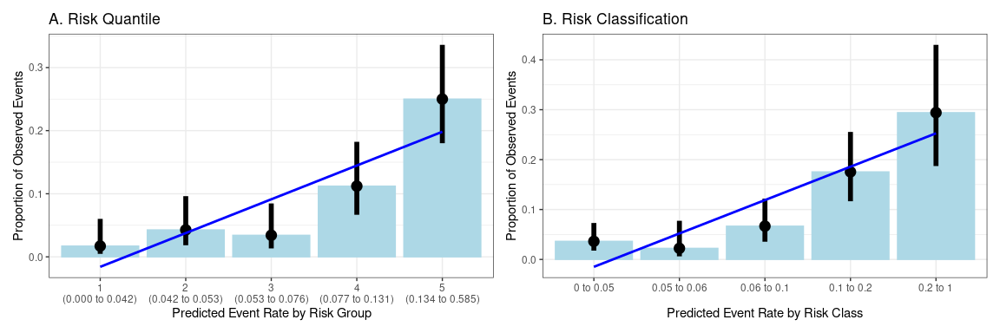
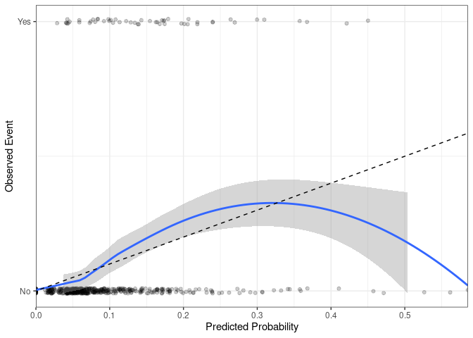

## Load data

Firstly let’s re-load our example data (the `survival::colon`)

    data <- tibble::as_tibble(survival::colon) %>%
      dplyr::filter(etype==2) %>% # Outcome of interest is death
      dplyr::filter(rx!="Obs") %>%  # rx will be our binary treatment variable
      dplyr::select(-etype,-study, -status) %>% # Remove superfluous variables
      
      # Convert into numeric and factor variables
      dplyr::mutate_at(vars(obstruct, perfor, adhere, node4), function(x){factor(x, levels=c(0,1), labels = c("No", "Yes"))}) %>%
      dplyr::mutate(rx = factor(rx),
                    mort365 = cut(time, breaks = c(-Inf, 365, Inf), labels = c("Yes", "No")),
                    mort365 = factor(mort365, levels = c("No", "Yes")),
                    sex = factor(sex, levels=c(0,1), labels = c("Female", "Male")),
                    differ = factor(differ, levels = c(1,2,3), labels = c("Well", "Moderate", "Poor")),
                    extent = factor(extent, levels = c(1,2,3, 4), labels = c("Submucosa", "Muscle", "Serosa", "Contiguous Structures")),
                    surg = factor(surg, levels = c(0,1), labels = c("Short", "Long")))

Now lets create our model fit (`fit`).

    fit <- finalfit::glmmulti(data, dependent = "mort365",
                              explanatory = c("rx", "sex","obstruct", "differ", "adhere", "perfor", "extent", "nodes", "surg"))

## Evaluating Calibration

## Calibration across Risk Groups

Traditionally, calibration would be assessed with plots of the
proportion of observed events (y-axis) within specified risk groups
(x-axis). This might be within quantiles (the sample equally divided
into X groups) or risk classifcations (specifiying the exact splits
between groups).

The `cal_plot()` function allows both to be done to allow visualisation
of the data.

    cal_plot(fit = fit, risk_ntile = 5) + ggtitle("A. Risk Quantile") + cal_plot(predictr = data %>% predictr(fit = fit), risk_class = c(0.05, 0.06, 0.1, 0.2)) + ggtitle("B. Risk Classification")

The categoried data can also be displayed in tables using the
`cal_table()` function:

    table <- data %>%
      predictr(fit = fit) %>%
      cal_table(risk_ntile = 5, risk_class = c(0.05, 0.06, 0.1, 0.2))

    table$ntile %>% knitr::kable()

<table>
<thead>
<tr>
<th style="text-align:left;">
ntile
</th>
<th style="text-align:right;">
n
</th>
<th style="text-align:right;">
event
</th>
<th style="text-align:right;">
prop
</th>
<th style="text-align:right;">
pred\_med
</th>
<th style="text-align:right;">
pred\_min
</th>
<th style="text-align:right;">
pred\_max
</th>
</tr>
</thead>
<tbody>
<tr>
<td style="text-align:left;">
1
</td>
<td style="text-align:right;">
117
</td>
<td style="text-align:right;">
2
</td>
<td style="text-align:right;">
0.017094
</td>
<td style="text-align:right;">
0.0215451
</td>
<td style="text-align:right;">
0.0000000
</td>
<td style="text-align:right;">
0.0415383
</td>
</tr>
<tr>
<td style="text-align:left;">
2
</td>
<td style="text-align:right;">
117
</td>
<td style="text-align:right;">
5
</td>
<td style="text-align:right;">
0.042735
</td>
<td style="text-align:right;">
0.0464945
</td>
<td style="text-align:right;">
0.0415383
</td>
<td style="text-align:right;">
0.0533199
</td>
</tr>
<tr>
<td style="text-align:left;">
3
</td>
<td style="text-align:right;">
117
</td>
<td style="text-align:right;">
4
</td>
<td style="text-align:right;">
0.034188
</td>
<td style="text-align:right;">
0.0618531
</td>
<td style="text-align:right;">
0.0533199
</td>
<td style="text-align:right;">
0.0760904
</td>
</tr>
<tr>
<td style="text-align:left;">
4
</td>
<td style="text-align:right;">
116
</td>
<td style="text-align:right;">
13
</td>
<td style="text-align:right;">
0.112069
</td>
<td style="text-align:right;">
0.0968864
</td>
<td style="text-align:right;">
0.0770344
</td>
<td style="text-align:right;">
0.1313318
</td>
</tr>
<tr>
<td style="text-align:left;">
5
</td>
<td style="text-align:right;">
116
</td>
<td style="text-align:right;">
29
</td>
<td style="text-align:right;">
0.250000
</td>
<td style="text-align:right;">
0.1871614
</td>
<td style="text-align:right;">
0.1340965
</td>
<td style="text-align:right;">
0.5854772
</td>
</tr>
</tbody>
</table>

    table$class %>% knitr::kable()

<table>
<thead>
<tr>
<th style="text-align:left;">
class
</th>
<th style="text-align:right;">
n
</th>
<th style="text-align:right;">
event
</th>
<th style="text-align:right;">
prop
</th>
<th style="text-align:right;">
pred\_med
</th>
<th style="text-align:right;">
pred\_min
</th>
<th style="text-align:right;">
pred\_max
</th>
</tr>
</thead>
<tbody>
<tr>
<td style="text-align:left;">
(0,0.05\]
</td>
<td style="text-align:right;">
193
</td>
<td style="text-align:right;">
7
</td>
<td style="text-align:right;">
0.0362694
</td>
<td style="text-align:right;">
0.0407751
</td>
<td style="text-align:right;">
0.0000000
</td>
<td style="text-align:right;">
0.0497845
</td>
</tr>
<tr>
<td style="text-align:left;">
(0.05,0.06\]
</td>
<td style="text-align:right;">
90
</td>
<td style="text-align:right;">
2
</td>
<td style="text-align:right;">
0.0222222
</td>
<td style="text-align:right;">
0.0533320
</td>
<td style="text-align:right;">
0.0504214
</td>
<td style="text-align:right;">
0.0596213
</td>
</tr>
<tr>
<td style="text-align:left;">
(0.06,0.1\]
</td>
<td style="text-align:right;">
135
</td>
<td style="text-align:right;">
9
</td>
<td style="text-align:right;">
0.0666667
</td>
<td style="text-align:right;">
0.0760904
</td>
<td style="text-align:right;">
0.0603197
</td>
<td style="text-align:right;">
0.0995768
</td>
</tr>
<tr>
<td style="text-align:left;">
(0.1,0.2\]
</td>
<td style="text-align:right;">
114
</td>
<td style="text-align:right;">
20
</td>
<td style="text-align:right;">
0.1754386
</td>
<td style="text-align:right;">
0.1415624
</td>
<td style="text-align:right;">
0.1011512
</td>
<td style="text-align:right;">
0.1994178
</td>
</tr>
<tr>
<td style="text-align:left;">
(0.2,1\]
</td>
<td style="text-align:right;">
51
</td>
<td style="text-align:right;">
15
</td>
<td style="text-align:right;">
0.2941176
</td>
<td style="text-align:right;">
0.2730587
</td>
<td style="text-align:right;">
0.2012504
</td>
<td style="text-align:right;">
0.5854772
</td>
</tr>
</tbody>
</table>

Traditionally calibration has been assessed via a Hosmer–Lemeshow (HL)
test to determine whether there is a perfect linear relationship between
the observed and predicted risk. The sample is divided into quantiles of
predicted risk (typically deciles).

-   However, this has many issues (oversensitive in large samples,
    losing nuance / power by categorisation, etc).

Using the `cal_metric()` function, we find the Hosmer–Lemeshow (HL) test
p-value is:

    cal_metric(fit = fit, risk_ntile = 10, hltest = T) %>% dplyr::pull(hl)

    ## [1] "0.335"

This suggests there is no statistical evidence of poor calibration
across the risk deciles.

## Calibration across Continuous Risk

However, while more understandable, this form of risk categorisation can
be arbitrary and loses nuances in the relationship.

Increasingly, calibration has been recommended to be assessed with the
predicted event rate as a continuous variable, plotted against the
occurrence of events (0 = “No”, 1 = “Yes”). We then plot a Loess curve
(line of best fit) to evaluate against a linear relationship, and look
at the intercept/slope instead.

    cal_plot(predictr = data %>% predictr(fit = fit), se=T)

We can assess the intercept and slope of the calibration curve using
`cal_metric()`. A “perfect” calibration will have an intercept of 0 and
a slope of 1.

For more information on how to interpret the results of these
calibration curves, please see the useful paper [Calibration: the
Achilles heel of predictive
analytics](https://bmcmedicine.biomedcentral.com/articles/10.1186/s12916-019-1466-7).

    cal_metric(predictr = data %>% predictr(fit = fit)) %>% knitr::kable()

<table>
<thead>
<tr>
<th style="text-align:left;">
intercept
</th>
<th style="text-align:left;">
slope
</th>
</tr>
</thead>
<tbody>
<tr>
<td style="text-align:left;">
0.000
</td>
<td style="text-align:left;">
1.000
</td>
</tr>
</tbody>
</table>
