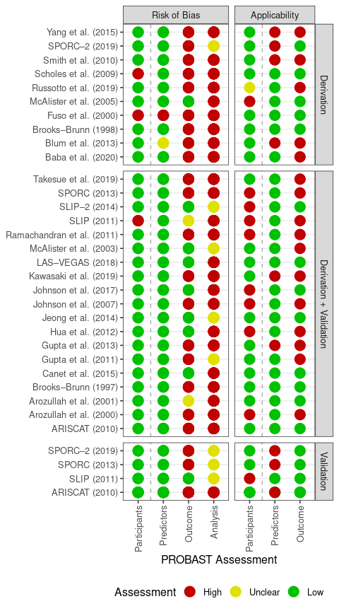

# Quality assessment of multivariable prediction models

For systematic reviews of multivariable prediction models the
“Transparent reporting of a multivariable prediction model for
individual prognosis or diagnosis” (TRIPOD) and “Prediction model Risk
Of Bias ASsessment Tool” (PROBAST) guidelines should be used to assess
the reporting and methodological quality of the predictive models
developed.

Displaying this output for papers can be a challenging task,
particularly as plots. `predictr` provides several functions to aid in
this.

## Transparent reporting of a multivariable prediction model for individual prognosis or diagnosis (TRIPOD)

Let’s use an inbuilt example from `predictr` of papers which have been
assessed against the TRIPOD statement.

Note there are 3 key categories of columns here:

1.  ID column (“score”): This is needed to identify which paper is
    referred to in each row and must be **unique** for each row.

2.  Type column (“type”): This is needed to identify what type of models
    are done in the paper (is it derivation and/or validation of a
    model). This is essential as this changes what items are needed to
    be assessed in the TRIPOD statement.

-   This must only contain 3 values: “d” = derivation only, “dv” =
    derivation and validation" or “v” = validation only.

1.  “item\_” columns: These refer to each respective item listed in the
    TRIPOD statement (item 1 to 22).

-   The names of these columns must be exactly the same as this example
    or else the subsequent function will not work.

-   This must only contain 4 values as specified in the TRIPOD statement
    (“Yes”, “Partial”, “No”, or “Not applicable”).

<!-- -->

    predictr::example_tripod %>% head(10) %>% knitr::kable()

<table>
<thead>
<tr>
<th style="text-align:left;">
score
</th>
<th style="text-align:left;">
type
</th>
<th style="text-align:left;">
item\_1
</th>
<th style="text-align:left;">
item\_2
</th>
<th style="text-align:left;">
item\_3a
</th>
<th style="text-align:left;">
item\_3b
</th>
<th style="text-align:left;">
item\_4a
</th>
<th style="text-align:left;">
item\_4b
</th>
<th style="text-align:left;">
item\_5a
</th>
<th style="text-align:left;">
item\_5b
</th>
<th style="text-align:left;">
item\_5c
</th>
<th style="text-align:left;">
item\_6a
</th>
<th style="text-align:left;">
item\_6b
</th>
<th style="text-align:left;">
item\_7a
</th>
<th style="text-align:left;">
item\_7b
</th>
<th style="text-align:left;">
item\_8
</th>
<th style="text-align:left;">
item\_9
</th>
<th style="text-align:left;">
item\_10a
</th>
<th style="text-align:left;">
item\_10b
</th>
<th style="text-align:left;">
item\_10c
</th>
<th style="text-align:left;">
item\_10d
</th>
<th style="text-align:left;">
item\_10e
</th>
<th style="text-align:left;">
item\_11
</th>
<th style="text-align:left;">
item\_12
</th>
<th style="text-align:left;">
item\_13a
</th>
<th style="text-align:left;">
item\_13b
</th>
<th style="text-align:left;">
item\_13c
</th>
<th style="text-align:left;">
item\_14a
</th>
<th style="text-align:left;">
item\_14b
</th>
<th style="text-align:left;">
item\_15a
</th>
<th style="text-align:left;">
item\_15b
</th>
<th style="text-align:left;">
item\_16
</th>
<th style="text-align:left;">
item\_17
</th>
<th style="text-align:left;">
item\_18
</th>
<th style="text-align:left;">
item\_19a
</th>
<th style="text-align:left;">
item\_19b
</th>
<th style="text-align:left;">
item\_20
</th>
<th style="text-align:left;">
item\_21
</th>
<th style="text-align:left;">
item\_22
</th>
</tr>
</thead>
<tbody>
<tr>
<td style="text-align:left;">
Brooks–Brunn (1997)
</td>
<td style="text-align:left;">
dv
</td>
<td style="text-align:left;">
Partial (P)
</td>
<td style="text-align:left;">
Yes (Y)
</td>
<td style="text-align:left;">
Yes (Y)
</td>
<td style="text-align:left;">
Yes (Y)
</td>
<td style="text-align:left;">
Yes (Y)
</td>
<td style="text-align:left;">
Yes (Y)
</td>
<td style="text-align:left;">
Yes (Y)
</td>
<td style="text-align:left;">
Yes (Y)
</td>
<td style="text-align:left;">
Yes (Y)
</td>
<td style="text-align:left;">
Yes (Y)
</td>
<td style="text-align:left;">
No (N)
</td>
<td style="text-align:left;">
Yes (Y)
</td>
<td style="text-align:left;">
No (N)
</td>
<td style="text-align:left;">
Yes (Y)
</td>
<td style="text-align:left;">
No (N)
</td>
<td style="text-align:left;">
Yes (Y)
</td>
<td style="text-align:left;">
Yes (Y)
</td>
<td style="text-align:left;">
Yes (Y)
</td>
<td style="text-align:left;">
Partial (P)
</td>
<td style="text-align:left;">
No (N)
</td>
<td style="text-align:left;">
Yes (Y)
</td>
<td style="text-align:left;">
Yes (Y)
</td>
<td style="text-align:left;">
Yes (Y)
</td>
<td style="text-align:left;">
Yes (Y)
</td>
<td style="text-align:left;">
Yes (Y)
</td>
<td style="text-align:left;">
Yes (Y)
</td>
<td style="text-align:left;">
Yes (Y)
</td>
<td style="text-align:left;">
Yes (Y)
</td>
<td style="text-align:left;">
Yes (Y)
</td>
<td style="text-align:left;">
Partial (P)
</td>
<td style="text-align:left;">
No (N)
</td>
<td style="text-align:left;">
Yes (Y)
</td>
<td style="text-align:left;">
Yes (Y)
</td>
<td style="text-align:left;">
Yes (Y)
</td>
<td style="text-align:left;">
Yes (Y)
</td>
<td style="text-align:left;">
No (N)
</td>
<td style="text-align:left;">
Partial (P)
</td>
</tr>
<tr>
<td style="text-align:left;">
Brooks–Brunn (1998)
</td>
<td style="text-align:left;">
d
</td>
<td style="text-align:left;">
No (N)
</td>
<td style="text-align:left;">
Yes (Y)
</td>
<td style="text-align:left;">
Yes (Y)
</td>
<td style="text-align:left;">
Yes (Y)
</td>
<td style="text-align:left;">
Yes (Y)
</td>
<td style="text-align:left;">
No (N)
</td>
<td style="text-align:left;">
Yes (Y)
</td>
<td style="text-align:left;">
Yes (Y)
</td>
<td style="text-align:left;">
Yes (Y)
</td>
<td style="text-align:left;">
Yes (Y)
</td>
<td style="text-align:left;">
No (N)
</td>
<td style="text-align:left;">
Yes (Y)
</td>
<td style="text-align:left;">
No (N)
</td>
<td style="text-align:left;">
Yes (Y)
</td>
<td style="text-align:left;">
No (N)
</td>
<td style="text-align:left;">
Yes (Y)
</td>
<td style="text-align:left;">
Yes (Y)
</td>
<td style="text-align:left;">
Not applicable (NA)
</td>
<td style="text-align:left;">
Partial (P)
</td>
<td style="text-align:left;">
Not applicable (NA)
</td>
<td style="text-align:left;">
Yes (Y)
</td>
<td style="text-align:left;">
Not applicable (NA)
</td>
<td style="text-align:left;">
Yes (Y)
</td>
<td style="text-align:left;">
Yes (Y)
</td>
<td style="text-align:left;">
Not applicable (NA)
</td>
<td style="text-align:left;">
Yes (Y)
</td>
<td style="text-align:left;">
Yes (Y)
</td>
<td style="text-align:left;">
Yes (Y)
</td>
<td style="text-align:left;">
Yes (Y)
</td>
<td style="text-align:left;">
Partial (P)
</td>
<td style="text-align:left;">
Not applicable (NA)
</td>
<td style="text-align:left;">
Yes (Y)
</td>
<td style="text-align:left;">
Not applicable (NA)
</td>
<td style="text-align:left;">
Yes (Y)
</td>
<td style="text-align:left;">
Yes (Y)
</td>
<td style="text-align:left;">
Yes (Y)
</td>
<td style="text-align:left;">
Yes (Y)
</td>
</tr>
<tr>
<td style="text-align:left;">
Arozullah et al. (2000)
</td>
<td style="text-align:left;">
dv
</td>
<td style="text-align:left;">
Partial (P)
</td>
<td style="text-align:left;">
Partial (P)
</td>
<td style="text-align:left;">
Yes (Y)
</td>
<td style="text-align:left;">
Yes (Y)
</td>
<td style="text-align:left;">
Yes (Y)
</td>
<td style="text-align:left;">
Yes (Y)
</td>
<td style="text-align:left;">
Partial (P)
</td>
<td style="text-align:left;">
Yes (Y)
</td>
<td style="text-align:left;">
Yes (Y)
</td>
<td style="text-align:left;">
Yes (Y)
</td>
<td style="text-align:left;">
No (N)
</td>
<td style="text-align:left;">
Yes (Y)
</td>
<td style="text-align:left;">
No (N)
</td>
<td style="text-align:left;">
Yes (Y)
</td>
<td style="text-align:left;">
Yes (Y)
</td>
<td style="text-align:left;">
Yes (Y)
</td>
<td style="text-align:left;">
Yes (Y)
</td>
<td style="text-align:left;">
Yes (Y)
</td>
<td style="text-align:left;">
Yes (Y)
</td>
<td style="text-align:left;">
No (N)
</td>
<td style="text-align:left;">
Partial (P)
</td>
<td style="text-align:left;">
Partial (P)
</td>
<td style="text-align:left;">
Partial (P)
</td>
<td style="text-align:left;">
Yes (Y)
</td>
<td style="text-align:left;">
No (N)
</td>
<td style="text-align:left;">
Yes (Y)
</td>
<td style="text-align:left;">
Yes (Y)
</td>
<td style="text-align:left;">
Partial (P)
</td>
<td style="text-align:left;">
Partial (P)
</td>
<td style="text-align:left;">
Yes (Y)
</td>
<td style="text-align:left;">
No (N)
</td>
<td style="text-align:left;">
Yes (Y)
</td>
<td style="text-align:left;">
Yes (Y)
</td>
<td style="text-align:left;">
Yes (Y)
</td>
<td style="text-align:left;">
Yes (Y)
</td>
<td style="text-align:left;">
No (N)
</td>
<td style="text-align:left;">
Yes (Y)
</td>
</tr>
<tr>
<td style="text-align:left;">
Fuso et al. (2000)
</td>
<td style="text-align:left;">
d
</td>
<td style="text-align:left;">
Partial (P)
</td>
<td style="text-align:left;">
Partial (P)
</td>
<td style="text-align:left;">
Yes (Y)
</td>
<td style="text-align:left;">
Yes (Y)
</td>
<td style="text-align:left;">
Yes (Y)
</td>
<td style="text-align:left;">
Yes (Y)
</td>
<td style="text-align:left;">
Yes (Y)
</td>
<td style="text-align:left;">
Partial (P)
</td>
<td style="text-align:left;">
Partial (P)
</td>
<td style="text-align:left;">
Partial (P)
</td>
<td style="text-align:left;">
No (N)
</td>
<td style="text-align:left;">
Yes (Y)
</td>
<td style="text-align:left;">
No (N)
</td>
<td style="text-align:left;">
Yes (Y)
</td>
<td style="text-align:left;">
No (N)
</td>
<td style="text-align:left;">
Yes (Y)
</td>
<td style="text-align:left;">
Partial (P)
</td>
<td style="text-align:left;">
Not applicable (NA)
</td>
<td style="text-align:left;">
Partial (P)
</td>
<td style="text-align:left;">
Not applicable (NA)
</td>
<td style="text-align:left;">
Yes (Y)
</td>
<td style="text-align:left;">
Not applicable (NA)
</td>
<td style="text-align:left;">
Partial (P)
</td>
<td style="text-align:left;">
Partial (P)
</td>
<td style="text-align:left;">
Not applicable (NA)
</td>
<td style="text-align:left;">
Yes (Y)
</td>
<td style="text-align:left;">
Yes (Y)
</td>
<td style="text-align:left;">
Yes (Y)
</td>
<td style="text-align:left;">
Partial (P)
</td>
<td style="text-align:left;">
No (N)
</td>
<td style="text-align:left;">
Not applicable (NA)
</td>
<td style="text-align:left;">
Partial (P)
</td>
<td style="text-align:left;">
Not applicable (NA)
</td>
<td style="text-align:left;">
Yes (Y)
</td>
<td style="text-align:left;">
Yes (Y)
</td>
<td style="text-align:left;">
No (N)
</td>
<td style="text-align:left;">
No (N)
</td>
</tr>
<tr>
<td style="text-align:left;">
Arozullah et al. (2001)
</td>
<td style="text-align:left;">
dv
</td>
<td style="text-align:left;">
Yes (Y)
</td>
<td style="text-align:left;">
Yes (Y)
</td>
<td style="text-align:left;">
Yes (Y)
</td>
<td style="text-align:left;">
Yes (Y)
</td>
<td style="text-align:left;">
Yes (Y)
</td>
<td style="text-align:left;">
Yes (Y)
</td>
<td style="text-align:left;">
Partial (P)
</td>
<td style="text-align:left;">
Yes (Y)
</td>
<td style="text-align:left;">
Partial (P)
</td>
<td style="text-align:left;">
Yes (Y)
</td>
<td style="text-align:left;">
No (N)
</td>
<td style="text-align:left;">
Yes (Y)
</td>
<td style="text-align:left;">
No (N)
</td>
<td style="text-align:left;">
Yes (Y)
</td>
<td style="text-align:left;">
Yes (Y)
</td>
<td style="text-align:left;">
Yes (Y)
</td>
<td style="text-align:left;">
Yes (Y)
</td>
<td style="text-align:left;">
Yes (Y)
</td>
<td style="text-align:left;">
Yes (Y)
</td>
<td style="text-align:left;">
No (N)
</td>
<td style="text-align:left;">
Yes (Y)
</td>
<td style="text-align:left;">
No (N)
</td>
<td style="text-align:left;">
Partial (P)
</td>
<td style="text-align:left;">
Yes (Y)
</td>
<td style="text-align:left;">
No (N)
</td>
<td style="text-align:left;">
Partial (P)
</td>
<td style="text-align:left;">
Yes (Y)
</td>
<td style="text-align:left;">
No (N)
</td>
<td style="text-align:left;">
Partial (P)
</td>
<td style="text-align:left;">
Yes (Y)
</td>
<td style="text-align:left;">
No (N)
</td>
<td style="text-align:left;">
Yes (Y)
</td>
<td style="text-align:left;">
Yes (Y)
</td>
<td style="text-align:left;">
Yes (Y)
</td>
<td style="text-align:left;">
Yes (Y)
</td>
<td style="text-align:left;">
No (N)
</td>
<td style="text-align:left;">
Yes (Y)
</td>
</tr>
<tr>
<td style="text-align:left;">
McAlister et al. (2003)
</td>
<td style="text-align:left;">
dv
</td>
<td style="text-align:left;">
Partial (P)
</td>
<td style="text-align:left;">
Partial (P)
</td>
<td style="text-align:left;">
Yes (Y)
</td>
<td style="text-align:left;">
Partial (P)
</td>
<td style="text-align:left;">
Yes (Y)
</td>
<td style="text-align:left;">
No (N)
</td>
<td style="text-align:left;">
Partial (P)
</td>
<td style="text-align:left;">
Partial (P)
</td>
<td style="text-align:left;">
Partial (P)
</td>
<td style="text-align:left;">
Yes (Y)
</td>
<td style="text-align:left;">
Yes (Y)
</td>
<td style="text-align:left;">
Partial (P)
</td>
<td style="text-align:left;">
Yes (Y)
</td>
<td style="text-align:left;">
Yes (Y)
</td>
<td style="text-align:left;">
No (N)
</td>
<td style="text-align:left;">
Partial (P)
</td>
<td style="text-align:left;">
Partial (P)
</td>
<td style="text-align:left;">
Partial (P)
</td>
<td style="text-align:left;">
Partial (P)
</td>
<td style="text-align:left;">
No (N)
</td>
<td style="text-align:left;">
No (N)
</td>
<td style="text-align:left;">
No (N)
</td>
<td style="text-align:left;">
Partial (P)
</td>
<td style="text-align:left;">
Partial (P)
</td>
<td style="text-align:left;">
No (N)
</td>
<td style="text-align:left;">
No (N)
</td>
<td style="text-align:left;">
Partial (P)
</td>
<td style="text-align:left;">
No (N)
</td>
<td style="text-align:left;">
No (N)
</td>
<td style="text-align:left;">
Yes (Y)
</td>
<td style="text-align:left;">
No (N)
</td>
<td style="text-align:left;">
Partial (P)
</td>
<td style="text-align:left;">
Partial (P)
</td>
<td style="text-align:left;">
Yes (Y)
</td>
<td style="text-align:left;">
Partial (P)
</td>
<td style="text-align:left;">
Yes (Y)
</td>
<td style="text-align:left;">
No (N)
</td>
</tr>
<tr>
<td style="text-align:left;">
McAlister et al. (2005)
</td>
<td style="text-align:left;">
d
</td>
<td style="text-align:left;">
Partial (P)
</td>
<td style="text-align:left;">
Partial (P)
</td>
<td style="text-align:left;">
Yes (Y)
</td>
<td style="text-align:left;">
Partial (P)
</td>
<td style="text-align:left;">
Yes (Y)
</td>
<td style="text-align:left;">
No (N)
</td>
<td style="text-align:left;">
Yes (Y)
</td>
<td style="text-align:left;">
Yes (Y)
</td>
<td style="text-align:left;">
Partial (P)
</td>
<td style="text-align:left;">
Yes (Y)
</td>
<td style="text-align:left;">
Yes (Y)
</td>
<td style="text-align:left;">
Partial (P)
</td>
<td style="text-align:left;">
Yes (Y)
</td>
<td style="text-align:left;">
Yes (Y)
</td>
<td style="text-align:left;">
No (N)
</td>
<td style="text-align:left;">
Partial (P)
</td>
<td style="text-align:left;">
Partial (P)
</td>
<td style="text-align:left;">
Not applicable (NA)
</td>
<td style="text-align:left;">
Partial (P)
</td>
<td style="text-align:left;">
Not applicable (NA)
</td>
<td style="text-align:left;">
No (N)
</td>
<td style="text-align:left;">
Not applicable (NA)
</td>
<td style="text-align:left;">
Partial (P)
</td>
<td style="text-align:left;">
Partial (P)
</td>
<td style="text-align:left;">
Not applicable (NA)
</td>
<td style="text-align:left;">
Yes (Y)
</td>
<td style="text-align:left;">
Partial (P)
</td>
<td style="text-align:left;">
No (N)
</td>
<td style="text-align:left;">
No (N)
</td>
<td style="text-align:left;">
Yes (Y)
</td>
<td style="text-align:left;">
Not applicable (NA)
</td>
<td style="text-align:left;">
Partial (P)
</td>
<td style="text-align:left;">
Not applicable (NA)
</td>
<td style="text-align:left;">
Yes (Y)
</td>
<td style="text-align:left;">
Partial (P)
</td>
<td style="text-align:left;">
Yes (Y)
</td>
<td style="text-align:left;">
No (N)
</td>
</tr>
<tr>
<td style="text-align:left;">
Johnson et al. (2007)
</td>
<td style="text-align:left;">
dv
</td>
<td style="text-align:left;">
Partial (P)
</td>
<td style="text-align:left;">
Yes (Y)
</td>
<td style="text-align:left;">
Yes (Y)
</td>
<td style="text-align:left;">
Yes (Y)
</td>
<td style="text-align:left;">
Yes (Y)
</td>
<td style="text-align:left;">
Yes (Y)
</td>
<td style="text-align:left;">
Partial (P)
</td>
<td style="text-align:left;">
Yes (Y)
</td>
<td style="text-align:left;">
Partial (P)
</td>
<td style="text-align:left;">
Yes (Y)
</td>
<td style="text-align:left;">
No (N)
</td>
<td style="text-align:left;">
Partial (P)
</td>
<td style="text-align:left;">
No (N)
</td>
<td style="text-align:left;">
Yes (Y)
</td>
<td style="text-align:left;">
Yes (Y)
</td>
<td style="text-align:left;">
Yes (Y)
</td>
<td style="text-align:left;">
Yes (Y)
</td>
<td style="text-align:left;">
Yes (Y)
</td>
<td style="text-align:left;">
Yes (Y)
</td>
<td style="text-align:left;">
No (N)
</td>
<td style="text-align:left;">
Yes (Y)
</td>
<td style="text-align:left;">
No (N)
</td>
<td style="text-align:left;">
Partial (P)
</td>
<td style="text-align:left;">
Yes (Y)
</td>
<td style="text-align:left;">
No (N)
</td>
<td style="text-align:left;">
Yes (Y)
</td>
<td style="text-align:left;">
Yes (Y)
</td>
<td style="text-align:left;">
Partial (P)
</td>
<td style="text-align:left;">
Partial (P)
</td>
<td style="text-align:left;">
Yes (Y)
</td>
<td style="text-align:left;">
No (N)
</td>
<td style="text-align:left;">
Yes (Y)
</td>
<td style="text-align:left;">
Partial (P)
</td>
<td style="text-align:left;">
Yes (Y)
</td>
<td style="text-align:left;">
Yes (Y)
</td>
<td style="text-align:left;">
No (N)
</td>
<td style="text-align:left;">
Yes (Y)
</td>
</tr>
<tr>
<td style="text-align:left;">
Scholes et al. (2009)
</td>
<td style="text-align:left;">
d
</td>
<td style="text-align:left;">
Partial (P)
</td>
<td style="text-align:left;">
Yes (Y)
</td>
<td style="text-align:left;">
Yes (Y)
</td>
<td style="text-align:left;">
Yes (Y)
</td>
<td style="text-align:left;">
Yes (Y)
</td>
<td style="text-align:left;">
Yes (Y)
</td>
<td style="text-align:left;">
Yes (Y)
</td>
<td style="text-align:left;">
Yes (Y)
</td>
<td style="text-align:left;">
Partial (P)
</td>
<td style="text-align:left;">
Yes (Y)
</td>
<td style="text-align:left;">
No (N)
</td>
<td style="text-align:left;">
Yes (Y)
</td>
<td style="text-align:left;">
No (N)
</td>
<td style="text-align:left;">
Yes (Y)
</td>
<td style="text-align:left;">
No (N)
</td>
<td style="text-align:left;">
Yes (Y)
</td>
<td style="text-align:left;">
Yes (Y)
</td>
<td style="text-align:left;">
Not applicable (NA)
</td>
<td style="text-align:left;">
Yes (Y)
</td>
<td style="text-align:left;">
Not applicable (NA)
</td>
<td style="text-align:left;">
No (N)
</td>
<td style="text-align:left;">
Not applicable (NA)
</td>
<td style="text-align:left;">
Yes (Y)
</td>
<td style="text-align:left;">
Yes (Y)
</td>
<td style="text-align:left;">
Not applicable (NA)
</td>
<td style="text-align:left;">
Yes (Y)
</td>
<td style="text-align:left;">
Yes (Y)
</td>
<td style="text-align:left;">
Yes (Y)
</td>
<td style="text-align:left;">
Partial (P)
</td>
<td style="text-align:left;">
Yes (Y)
</td>
<td style="text-align:left;">
Not applicable (NA)
</td>
<td style="text-align:left;">
Yes (Y)
</td>
<td style="text-align:left;">
Not applicable (NA)
</td>
<td style="text-align:left;">
Yes (Y)
</td>
<td style="text-align:left;">
Yes (Y)
</td>
<td style="text-align:left;">
No (N)
</td>
<td style="text-align:left;">
Yes (Y)
</td>
</tr>
<tr>
<td style="text-align:left;">
ARISCAT (2010)
</td>
<td style="text-align:left;">
dv
</td>
<td style="text-align:left;">
Partial (P)
</td>
<td style="text-align:left;">
Yes (Y)
</td>
<td style="text-align:left;">
Yes (Y)
</td>
<td style="text-align:left;">
Yes (Y)
</td>
<td style="text-align:left;">
Yes (Y)
</td>
<td style="text-align:left;">
Yes (Y)
</td>
<td style="text-align:left;">
Partial (P)
</td>
<td style="text-align:left;">
Yes (Y)
</td>
<td style="text-align:left;">
Partial (P)
</td>
<td style="text-align:left;">
Yes (Y)
</td>
<td style="text-align:left;">
Yes (Y)
</td>
<td style="text-align:left;">
Partial (P)
</td>
<td style="text-align:left;">
Yes (Y)
</td>
<td style="text-align:left;">
Yes (Y)
</td>
<td style="text-align:left;">
Partial (P)
</td>
<td style="text-align:left;">
Yes (Y)
</td>
<td style="text-align:left;">
Yes (Y)
</td>
<td style="text-align:left;">
Yes (Y)
</td>
<td style="text-align:left;">
Yes (Y)
</td>
<td style="text-align:left;">
No (N)
</td>
<td style="text-align:left;">
Partial (P)
</td>
<td style="text-align:left;">
Partial (P)
</td>
<td style="text-align:left;">
Partial (P)
</td>
<td style="text-align:left;">
Partial (P)
</td>
<td style="text-align:left;">
No (N)
</td>
<td style="text-align:left;">
Yes (Y)
</td>
<td style="text-align:left;">
Yes (Y)
</td>
<td style="text-align:left;">
Yes (Y)
</td>
<td style="text-align:left;">
Partial (P)
</td>
<td style="text-align:left;">
Yes (Y)
</td>
<td style="text-align:left;">
No (N)
</td>
<td style="text-align:left;">
Yes (Y)
</td>
<td style="text-align:left;">
Yes (Y)
</td>
<td style="text-align:left;">
Yes (Y)
</td>
<td style="text-align:left;">
Yes (Y)
</td>
<td style="text-align:left;">
Yes (Y)
</td>
<td style="text-align:left;">
Yes (Y)
</td>
</tr>
</tbody>
</table>

Once your TRIPOD data matches the format of `predictr::example_tripod`,
this can be put into the `tripod_format()` function to prepare this for
plotting.

-   You can specify what the “id” and “type” columns are called, but as
    mentioned above the naming format of the “item\_” columns must match
    exactly.

<!-- -->

    tripod_prep <- predictr::example_tripod %>%
      tripod_format(id = "score", type = "type")

    knitr::kable(head(tripod_prep, 10))

<table>
<thead>
<tr>
<th style="text-align:left;">
id
</th>
<th style="text-align:left;">
type
</th>
<th style="text-align:left;">
item
</th>
<th style="text-align:left;">
value
</th>
</tr>
</thead>
<tbody>
<tr>
<td style="text-align:left;">
Brooks–Brunn (1997)
</td>
<td style="text-align:left;">
Derivation + Validation
</td>
<td style="text-align:left;">
1
</td>
<td style="text-align:left;">
Partial
</td>
</tr>
<tr>
<td style="text-align:left;">
Brooks–Brunn (1997)
</td>
<td style="text-align:left;">
Derivation + Validation
</td>
<td style="text-align:left;">
2
</td>
<td style="text-align:left;">
Yes
</td>
</tr>
<tr>
<td style="text-align:left;">
Brooks–Brunn (1997)
</td>
<td style="text-align:left;">
Derivation + Validation
</td>
<td style="text-align:left;">
3a
</td>
<td style="text-align:left;">
Yes
</td>
</tr>
<tr>
<td style="text-align:left;">
Brooks–Brunn (1997)
</td>
<td style="text-align:left;">
Derivation + Validation
</td>
<td style="text-align:left;">
3b
</td>
<td style="text-align:left;">
Yes
</td>
</tr>
<tr>
<td style="text-align:left;">
Brooks–Brunn (1997)
</td>
<td style="text-align:left;">
Derivation + Validation
</td>
<td style="text-align:left;">
4a
</td>
<td style="text-align:left;">
Yes
</td>
</tr>
<tr>
<td style="text-align:left;">
Brooks–Brunn (1997)
</td>
<td style="text-align:left;">
Derivation + Validation
</td>
<td style="text-align:left;">
4b
</td>
<td style="text-align:left;">
Yes
</td>
</tr>
<tr>
<td style="text-align:left;">
Brooks–Brunn (1997)
</td>
<td style="text-align:left;">
Derivation + Validation
</td>
<td style="text-align:left;">
5a
</td>
<td style="text-align:left;">
Yes
</td>
</tr>
<tr>
<td style="text-align:left;">
Brooks–Brunn (1997)
</td>
<td style="text-align:left;">
Derivation + Validation
</td>
<td style="text-align:left;">
5b
</td>
<td style="text-align:left;">
Yes
</td>
</tr>
<tr>
<td style="text-align:left;">
Brooks–Brunn (1997)
</td>
<td style="text-align:left;">
Derivation + Validation
</td>
<td style="text-align:left;">
5c
</td>
<td style="text-align:left;">
Yes
</td>
</tr>
<tr>
<td style="text-align:left;">
Brooks–Brunn (1997)
</td>
<td style="text-align:left;">
Derivation + Validation
</td>
<td style="text-align:left;">
6a
</td>
<td style="text-align:left;">
Yes
</td>
</tr>
</tbody>
</table>

Now we have the data in the required format, we can then plot it using
`tripod_plot()`. This produces a high quality ggplot of the TRIPOD
results.

     predictr::example_tripod %>%
      tripod_format(id = "score", type = "type") %>%
      tripod_plot()

## Prediction model Risk Of Bias ASsessment Tool (PROBAST)

Let’s use an inbuilt example from `predictr` of papers which have been
assessed against the PROBAST tool.

Like the example above for TRIPOD, there are 4 key categories of columns
here:

1.  ID column (“score”): This is needed to identify which paper is
    referred to in each row and must be **unique** for each row.

2.  Type column (“type”): This is needed to identify what type of models
    are done in the paper (is it derivation and/or validation of a
    model). This is essential as this changes what items are needed to
    be assessed in the PROBAST tool.

-   This must only contain 3 values: “d” = derivation only, “dv” =
    derivation and validation" or “v” = validation only.

1.  “rob\_” columns: These refer to each respective risk of bias (ROB)
    assessment using PROBAST for each domain (1 = “Participants”, 2 =
    “Predictors”, 3 = “Outcome”, and 4 = “Analysis”) and the respective
    screening questions.

-   The names of these columns must be exactly the same as this example
    or else the subsequent function will not work.

-   This must only contain 5 values as specified in the PROBAST tool
    (“yes,” “probably yes,” “probably no,” “no,” or “no information”).

1.  “app\_” columns: These refer to each respective applicability
    assessment using PROBAST for each domain (1 = “Participants”, 2 =
    “Predictors”, and 3 = “Outcome”).

-   The names of these columns must be exactly the same as this example
    or else the subsequent function will not work.

-   This must only contain 3 values as specified in the PROBAST tool
    (low, unclear, high). Note this assessment is specifically “concerns
    regarding applicability”, rather than whether the model is
    applicable.

-   The 4th domain (“Analysis”) is not assessed in PROBAST regarding
    “concerns regarding applicability”.

<!-- -->

    predictr::example_probast %>% head(10) %>% knitr::kable()

<table>
<thead>
<tr>
<th style="text-align:left;">
score
</th>
<th style="text-align:left;">
type
</th>
<th style="text-align:left;">
rob\_1\_1
</th>
<th style="text-align:left;">
rob\_1\_2
</th>
<th style="text-align:left;">
rob\_2\_1
</th>
<th style="text-align:left;">
rob\_2\_2
</th>
<th style="text-align:left;">
rob\_2\_3
</th>
<th style="text-align:left;">
rob\_3\_1
</th>
<th style="text-align:left;">
rob\_3\_2
</th>
<th style="text-align:left;">
rob\_3\_3
</th>
<th style="text-align:left;">
rob\_3\_4
</th>
<th style="text-align:left;">
rob\_3\_5
</th>
<th style="text-align:left;">
rob\_3\_6
</th>
<th style="text-align:left;">
rob\_4\_1
</th>
<th style="text-align:left;">
rob\_4\_2
</th>
<th style="text-align:left;">
rob\_4\_3
</th>
<th style="text-align:left;">
rob\_4\_4
</th>
<th style="text-align:left;">
rob\_4\_5
</th>
<th style="text-align:left;">
rob\_4\_6
</th>
<th style="text-align:left;">
rob\_4\_7
</th>
<th style="text-align:left;">
rob\_4\_8
</th>
<th style="text-align:left;">
rob\_4\_9
</th>
<th style="text-align:left;">
app\_1
</th>
<th style="text-align:left;">
app\_2
</th>
<th style="text-align:left;">
app\_3
</th>
</tr>
</thead>
<tbody>
<tr>
<td style="text-align:left;">
Brooks–Brunn (1997)
</td>
<td style="text-align:left;">
dv
</td>
<td style="text-align:left;">
Probably yes (PY)
</td>
<td style="text-align:left;">
Probably yes (PY)
</td>
<td style="text-align:left;">
Probably yes (PY)
</td>
<td style="text-align:left;">
Probably yes (PY)
</td>
<td style="text-align:left;">
Yes (Y)
</td>
<td style="text-align:left;">
Yes (Y)
</td>
<td style="text-align:left;">
No (N)
</td>
<td style="text-align:left;">
Yes (Y)
</td>
<td style="text-align:left;">
Probably yes (PY)
</td>
<td style="text-align:left;">
Probably no (PN)
</td>
<td style="text-align:left;">
Probably yes (PY)
</td>
<td style="text-align:left;">
Yes (Y)
</td>
<td style="text-align:left;">
Yes (Y)
</td>
<td style="text-align:left;">
No information (NI)
</td>
<td style="text-align:left;">
No information (NI)
</td>
<td style="text-align:left;">
No (N)
</td>
<td style="text-align:left;">
No information (NI)
</td>
<td style="text-align:left;">
Yes (Y)
</td>
<td style="text-align:left;">
No (N)
</td>
<td style="text-align:left;">
Yes (Y)
</td>
<td style="text-align:left;">
Low
</td>
<td style="text-align:left;">
Low
</td>
<td style="text-align:left;">
Low
</td>
</tr>
<tr>
<td style="text-align:left;">
Brooks–Brunn (1998)
</td>
<td style="text-align:left;">
d
</td>
<td style="text-align:left;">
Probably yes (PY)
</td>
<td style="text-align:left;">
Probably yes (PY)
</td>
<td style="text-align:left;">
Probably yes (PY)
</td>
<td style="text-align:left;">
Probably yes (PY)
</td>
<td style="text-align:left;">
Yes (Y)
</td>
<td style="text-align:left;">
Yes (Y)
</td>
<td style="text-align:left;">
No (N)
</td>
<td style="text-align:left;">
Yes (Y)
</td>
<td style="text-align:left;">
Probably yes (PY)
</td>
<td style="text-align:left;">
Probably no (PN)
</td>
<td style="text-align:left;">
Probably yes (PY)
</td>
<td style="text-align:left;">
Yes (Y)
</td>
<td style="text-align:left;">
Yes (Y)
</td>
<td style="text-align:left;">
No information (NI)
</td>
<td style="text-align:left;">
No information (NI)
</td>
<td style="text-align:left;">
No (N)
</td>
<td style="text-align:left;">
No information (NI)
</td>
<td style="text-align:left;">
Yes (Y)
</td>
<td style="text-align:left;">
No (N)
</td>
<td style="text-align:left;">
Yes (Y)
</td>
<td style="text-align:left;">
Low
</td>
<td style="text-align:left;">
Low
</td>
<td style="text-align:left;">
Low
</td>
</tr>
<tr>
<td style="text-align:left;">
Arozullah et al. (2000)
</td>
<td style="text-align:left;">
dv
</td>
<td style="text-align:left;">
Probably yes (PY)
</td>
<td style="text-align:left;">
Probably yes (PY)
</td>
<td style="text-align:left;">
Yes (Y)
</td>
<td style="text-align:left;">
Probably yes (PY)
</td>
<td style="text-align:left;">
Yes (Y)
</td>
<td style="text-align:left;">
Yes (Y)
</td>
<td style="text-align:left;">
No (N)
</td>
<td style="text-align:left;">
Yes (Y)
</td>
<td style="text-align:left;">
Probably yes (PY)
</td>
<td style="text-align:left;">
No information (NI)
</td>
<td style="text-align:left;">
Yes (Y)
</td>
<td style="text-align:left;">
Yes (Y)
</td>
<td style="text-align:left;">
Yes (Y)
</td>
<td style="text-align:left;">
No (N)
</td>
<td style="text-align:left;">
Yes (Y)
</td>
<td style="text-align:left;">
Yes (Y)
</td>
<td style="text-align:left;">
Yes (Y)
</td>
<td style="text-align:left;">
Yes (Y)
</td>
<td style="text-align:left;">
Yes (Y)
</td>
<td style="text-align:left;">
Yes (Y)
</td>
<td style="text-align:left;">
High
</td>
<td style="text-align:left;">
Low
</td>
<td style="text-align:left;">
High
</td>
</tr>
<tr>
<td style="text-align:left;">
Fuso et al. (2000)
</td>
<td style="text-align:left;">
d
</td>
<td style="text-align:left;">
Probably yes (PY)
</td>
<td style="text-align:left;">
No (N)
</td>
<td style="text-align:left;">
Probably yes (PY)
</td>
<td style="text-align:left;">
Probably no (PN)
</td>
<td style="text-align:left;">
Yes (Y)
</td>
<td style="text-align:left;">
Yes (Y)
</td>
<td style="text-align:left;">
No (N)
</td>
<td style="text-align:left;">
Yes (Y)
</td>
<td style="text-align:left;">
Probably yes (PY)
</td>
<td style="text-align:left;">
Probably no (PN)
</td>
<td style="text-align:left;">
Yes (Y)
</td>
<td style="text-align:left;">
Yes (Y)
</td>
<td style="text-align:left;">
Yes (Y)
</td>
<td style="text-align:left;">
No information (NI)
</td>
<td style="text-align:left;">
No information (NI)
</td>
<td style="text-align:left;">
No (N)
</td>
<td style="text-align:left;">
No information (NI)
</td>
<td style="text-align:left;">
Yes (Y)
</td>
<td style="text-align:left;">
Yes (Y)
</td>
<td style="text-align:left;">
Yes (Y)
</td>
<td style="text-align:left;">
Low
</td>
<td style="text-align:left;">
Low
</td>
<td style="text-align:left;">
Low
</td>
</tr>
<tr>
<td style="text-align:left;">
Arozullah et al. (2001)
</td>
<td style="text-align:left;">
dv
</td>
<td style="text-align:left;">
Probably yes (PY)
</td>
<td style="text-align:left;">
Probably yes (PY)
</td>
<td style="text-align:left;">
Yes (Y)
</td>
<td style="text-align:left;">
Probably yes (PY)
</td>
<td style="text-align:left;">
Yes (Y)
</td>
<td style="text-align:left;">
Yes (Y)
</td>
<td style="text-align:left;">
Yes (Y)
</td>
<td style="text-align:left;">
Yes (Y)
</td>
<td style="text-align:left;">
Probably yes (PY)
</td>
<td style="text-align:left;">
No information (NI)
</td>
<td style="text-align:left;">
Yes (Y)
</td>
<td style="text-align:left;">
Yes (Y)
</td>
<td style="text-align:left;">
Yes (Y)
</td>
<td style="text-align:left;">
No (N)
</td>
<td style="text-align:left;">
Yes (Y)
</td>
<td style="text-align:left;">
Yes (Y)
</td>
<td style="text-align:left;">
Yes (Y)
</td>
<td style="text-align:left;">
Yes (Y)
</td>
<td style="text-align:left;">
Yes (Y)
</td>
<td style="text-align:left;">
Yes (Y)
</td>
<td style="text-align:left;">
Low
</td>
<td style="text-align:left;">
Low
</td>
<td style="text-align:left;">
Low
</td>
</tr>
<tr>
<td style="text-align:left;">
McAlister et al. (2003)
</td>
<td style="text-align:left;">
dv
</td>
<td style="text-align:left;">
Yes (Y)
</td>
<td style="text-align:left;">
Yes (Y)
</td>
<td style="text-align:left;">
Yes (Y)
</td>
<td style="text-align:left;">
Yes (Y)
</td>
<td style="text-align:left;">
Yes (Y)
</td>
<td style="text-align:left;">
Yes (Y)
</td>
<td style="text-align:left;">
Yes (Y)
</td>
<td style="text-align:left;">
Yes (Y)
</td>
<td style="text-align:left;">
Probably yes (PY)
</td>
<td style="text-align:left;">
Yes (Y)
</td>
<td style="text-align:left;">
Yes (Y)
</td>
<td style="text-align:left;">
Probably yes (PY)
</td>
<td style="text-align:left;">
Yes (Y)
</td>
<td style="text-align:left;">
No information (NI)
</td>
<td style="text-align:left;">
No information (NI)
</td>
<td style="text-align:left;">
Yes (Y)
</td>
<td style="text-align:left;">
No information (NI)
</td>
<td style="text-align:left;">
Yes (Y)
</td>
<td style="text-align:left;">
No information (NI)
</td>
<td style="text-align:left;">
Yes (Y)
</td>
<td style="text-align:left;">
Low
</td>
<td style="text-align:left;">
Low
</td>
<td style="text-align:left;">
High
</td>
</tr>
<tr>
<td style="text-align:left;">
McAlister et al. (2005)
</td>
<td style="text-align:left;">
d
</td>
<td style="text-align:left;">
Yes (Y)
</td>
<td style="text-align:left;">
Yes (Y)
</td>
<td style="text-align:left;">
Yes (Y)
</td>
<td style="text-align:left;">
Yes (Y)
</td>
<td style="text-align:left;">
Yes (Y)
</td>
<td style="text-align:left;">
Yes (Y)
</td>
<td style="text-align:left;">
Yes (Y)
</td>
<td style="text-align:left;">
Yes (Y)
</td>
<td style="text-align:left;">
Yes (Y)
</td>
<td style="text-align:left;">
Yes (Y)
</td>
<td style="text-align:left;">
Yes (Y)
</td>
<td style="text-align:left;">
Yes (Y)
</td>
<td style="text-align:left;">
Yes (Y)
</td>
<td style="text-align:left;">
No information (NI)
</td>
<td style="text-align:left;">
No information (NI)
</td>
<td style="text-align:left;">
No (N)
</td>
<td style="text-align:left;">
No information (NI)
</td>
<td style="text-align:left;">
Yes (Y)
</td>
<td style="text-align:left;">
No (N)
</td>
<td style="text-align:left;">
No information (NI)
</td>
<td style="text-align:left;">
High
</td>
<td style="text-align:left;">
Low
</td>
<td style="text-align:left;">
Low
</td>
</tr>
<tr>
<td style="text-align:left;">
Johnson et al. (2007)
</td>
<td style="text-align:left;">
dv
</td>
<td style="text-align:left;">
Probably yes (PY)
</td>
<td style="text-align:left;">
Yes (Y)
</td>
<td style="text-align:left;">
Yes (Y)
</td>
<td style="text-align:left;">
Probably yes (PY)
</td>
<td style="text-align:left;">
Yes (Y)
</td>
<td style="text-align:left;">
Yes (Y)
</td>
<td style="text-align:left;">
No (N)
</td>
<td style="text-align:left;">
Yes (Y)
</td>
<td style="text-align:left;">
Yes (Y)
</td>
<td style="text-align:left;">
Probably no (PN)
</td>
<td style="text-align:left;">
Yes (Y)
</td>
<td style="text-align:left;">
Yes (Y)
</td>
<td style="text-align:left;">
Yes (Y)
</td>
<td style="text-align:left;">
No (N)
</td>
<td style="text-align:left;">
No information (NI)
</td>
<td style="text-align:left;">
No (N)
</td>
<td style="text-align:left;">
No (N)
</td>
<td style="text-align:left;">
Yes (Y)
</td>
<td style="text-align:left;">
No (N)
</td>
<td style="text-align:left;">
Yes (Y)
</td>
<td style="text-align:left;">
High
</td>
<td style="text-align:left;">
Low
</td>
<td style="text-align:left;">
High
</td>
</tr>
<tr>
<td style="text-align:left;">
Scholes et al. (2009)
</td>
<td style="text-align:left;">
d
</td>
<td style="text-align:left;">
Yes (Y)
</td>
<td style="text-align:left;">
No (N)
</td>
<td style="text-align:left;">
Probably yes (PY)
</td>
<td style="text-align:left;">
Probably yes (PY)
</td>
<td style="text-align:left;">
Yes (Y)
</td>
<td style="text-align:left;">
Probably yes (PY)
</td>
<td style="text-align:left;">
Yes (Y)
</td>
<td style="text-align:left;">
Yes (Y)
</td>
<td style="text-align:left;">
Probably yes (PY)
</td>
<td style="text-align:left;">
Probably no (PN)
</td>
<td style="text-align:left;">
Yes (Y)
</td>
<td style="text-align:left;">
Yes (Y)
</td>
<td style="text-align:left;">
Yes (Y)
</td>
<td style="text-align:left;">
No (N)
</td>
<td style="text-align:left;">
No information (NI)
</td>
<td style="text-align:left;">
No (N)
</td>
<td style="text-align:left;">
No information (NI)
</td>
<td style="text-align:left;">
Yes (Y)
</td>
<td style="text-align:left;">
No (N)
</td>
<td style="text-align:left;">
Yes (Y)
</td>
<td style="text-align:left;">
Low
</td>
<td style="text-align:left;">
Low
</td>
<td style="text-align:left;">
Low
</td>
</tr>
<tr>
<td style="text-align:left;">
ARISCAT (2010)
</td>
<td style="text-align:left;">
dv
</td>
<td style="text-align:left;">
Yes (Y)
</td>
<td style="text-align:left;">
Yes (Y)
</td>
<td style="text-align:left;">
Probably yes (PY)
</td>
<td style="text-align:left;">
Probably yes (PY)
</td>
<td style="text-align:left;">
Yes (Y)
</td>
<td style="text-align:left;">
Probably yes (PY)
</td>
<td style="text-align:left;">
Yes (Y)
</td>
<td style="text-align:left;">
Yes (Y)
</td>
<td style="text-align:left;">
Probably yes (PY)
</td>
<td style="text-align:left;">
Probably no (PN)
</td>
<td style="text-align:left;">
Yes (Y)
</td>
<td style="text-align:left;">
Yes (Y)
</td>
<td style="text-align:left;">
Yes (Y)
</td>
<td style="text-align:left;">
No (N)
</td>
<td style="text-align:left;">
Yes (Y)
</td>
<td style="text-align:left;">
Probably no (PN)
</td>
<td style="text-align:left;">
Yes (Y)
</td>
<td style="text-align:left;">
Yes (Y)
</td>
<td style="text-align:left;">
Probably no (PN)
</td>
<td style="text-align:left;">
Yes (Y)
</td>
<td style="text-align:left;">
Low
</td>
<td style="text-align:left;">
Low
</td>
<td style="text-align:left;">
Low
</td>
</tr>
</tbody>
</table>

Once your TRIPOD data matches the format of `predictr::example_tripod`,
this can be put into the `tripod_format()` function to prepare this for
plotting.

-   You can specify what the “id” and “type” columns are called, but as
    mentioned above the naming format of the “item\_” columns must match
    exactly.

<!-- -->

    probast_prep <- predictr::example_probast %>%
      probast_format(id = "score", type = "type")

    knitr::kable(head(probast_prep, 10))

<table>
<thead>
<tr>
<th style="text-align:left;">
id
</th>
<th style="text-align:left;">
type
</th>
<th style="text-align:left;">
domain
</th>
<th style="text-align:left;">
subdomain
</th>
<th style="text-align:left;">
assess
</th>
<th style="text-align:left;">
item
</th>
<th style="text-align:left;">
value
</th>
</tr>
</thead>
<tbody>
<tr>
<td style="text-align:left;">
Brooks–Brunn (1997)
</td>
<td style="text-align:left;">
Derivation + Validation
</td>
<td style="text-align:left;">
Risk of Bias
</td>
<td style="text-align:left;">
Participants
</td>
<td style="text-align:left;">
Low
</td>
<td style="text-align:left;">
1
</td>
<td style="text-align:left;">
PY
</td>
</tr>
<tr>
<td style="text-align:left;">
Brooks–Brunn (1997)
</td>
<td style="text-align:left;">
Derivation + Validation
</td>
<td style="text-align:left;">
Risk of Bias
</td>
<td style="text-align:left;">
Participants
</td>
<td style="text-align:left;">
Low
</td>
<td style="text-align:left;">
2
</td>
<td style="text-align:left;">
PY
</td>
</tr>
<tr>
<td style="text-align:left;">
Brooks–Brunn (1997)
</td>
<td style="text-align:left;">
Derivation + Validation
</td>
<td style="text-align:left;">
Risk of Bias
</td>
<td style="text-align:left;">
Predictors
</td>
<td style="text-align:left;">
Low
</td>
<td style="text-align:left;">
1
</td>
<td style="text-align:left;">
PY
</td>
</tr>
<tr>
<td style="text-align:left;">
Brooks–Brunn (1997)
</td>
<td style="text-align:left;">
Derivation + Validation
</td>
<td style="text-align:left;">
Risk of Bias
</td>
<td style="text-align:left;">
Predictors
</td>
<td style="text-align:left;">
Low
</td>
<td style="text-align:left;">
2
</td>
<td style="text-align:left;">
PY
</td>
</tr>
<tr>
<td style="text-align:left;">
Brooks–Brunn (1997)
</td>
<td style="text-align:left;">
Derivation + Validation
</td>
<td style="text-align:left;">
Risk of Bias
</td>
<td style="text-align:left;">
Predictors
</td>
<td style="text-align:left;">
Low
</td>
<td style="text-align:left;">
3
</td>
<td style="text-align:left;">
Y
</td>
</tr>
<tr>
<td style="text-align:left;">
Brooks–Brunn (1997)
</td>
<td style="text-align:left;">
Derivation + Validation
</td>
<td style="text-align:left;">
Risk of Bias
</td>
<td style="text-align:left;">
Outcome
</td>
<td style="text-align:left;">
High
</td>
<td style="text-align:left;">
1
</td>
<td style="text-align:left;">
Y
</td>
</tr>
<tr>
<td style="text-align:left;">
Brooks–Brunn (1997)
</td>
<td style="text-align:left;">
Derivation + Validation
</td>
<td style="text-align:left;">
Risk of Bias
</td>
<td style="text-align:left;">
Outcome
</td>
<td style="text-align:left;">
High
</td>
<td style="text-align:left;">
2
</td>
<td style="text-align:left;">
N
</td>
</tr>
<tr>
<td style="text-align:left;">
Brooks–Brunn (1997)
</td>
<td style="text-align:left;">
Derivation + Validation
</td>
<td style="text-align:left;">
Risk of Bias
</td>
<td style="text-align:left;">
Outcome
</td>
<td style="text-align:left;">
High
</td>
<td style="text-align:left;">
3
</td>
<td style="text-align:left;">
Y
</td>
</tr>
<tr>
<td style="text-align:left;">
Brooks–Brunn (1997)
</td>
<td style="text-align:left;">
Derivation + Validation
</td>
<td style="text-align:left;">
Risk of Bias
</td>
<td style="text-align:left;">
Outcome
</td>
<td style="text-align:left;">
High
</td>
<td style="text-align:left;">
4
</td>
<td style="text-align:left;">
PY
</td>
</tr>
<tr>
<td style="text-align:left;">
Brooks–Brunn (1997)
</td>
<td style="text-align:left;">
Derivation + Validation
</td>
<td style="text-align:left;">
Risk of Bias
</td>
<td style="text-align:left;">
Outcome
</td>
<td style="text-align:left;">
High
</td>
<td style="text-align:left;">
5
</td>
<td style="text-align:left;">
PN
</td>
</tr>
</tbody>
</table>

Now we have the data in the required format, we can then plot it using
`probast_plot()`. This produces a high quality ggplot of the PROBAST
results.

     predictr::example_probast %>%
      probast_format(id = "score", type = "type") %>%
      probast_plot()

For PROBAST, the risk of bias (ROB) assessment is a composite assessment
across all screening questions in the domain. This is calculated
automatically by the `probast_plot()` function. However, if you want
that ROB screening question data for a supplementary table, then you can
use the `probast_table()` function.

     predictr::example_probast %>%
      probast_format(id = "score", type = "type") %>%
      probast_table() %>%  head(10) %>% knitr::kable()

<table>
<thead>
<tr>
<th style="text-align:left;">
id
</th>
<th style="text-align:left;">
type
</th>
<th style="text-align:left;">
Participants 1
</th>
<th style="text-align:left;">
Participants 2
</th>
<th style="text-align:left;">
Predictors 1
</th>
<th style="text-align:left;">
Predictors 2
</th>
<th style="text-align:left;">
Predictors 3
</th>
<th style="text-align:left;">
Outcome 1
</th>
<th style="text-align:left;">
Outcome 2
</th>
<th style="text-align:left;">
Outcome 3
</th>
<th style="text-align:left;">
Outcome 4
</th>
<th style="text-align:left;">
Outcome 5
</th>
<th style="text-align:left;">
Outcome 6
</th>
<th style="text-align:left;">
Analysis 1
</th>
<th style="text-align:left;">
Analysis 2
</th>
<th style="text-align:left;">
Analysis 3
</th>
<th style="text-align:left;">
Analysis 4
</th>
<th style="text-align:left;">
Analysis 5
</th>
<th style="text-align:left;">
Analysis 6
</th>
<th style="text-align:left;">
Analysis 7
</th>
<th style="text-align:left;">
Analysis 8
</th>
<th style="text-align:left;">
Analysis 9
</th>
</tr>
</thead>
<tbody>
<tr>
<td style="text-align:left;">
Brooks–Brunn (1997)
</td>
<td style="text-align:left;">
Derivation + Validation
</td>
<td style="text-align:left;">
PY
</td>
<td style="text-align:left;">
PY
</td>
<td style="text-align:left;">
PY
</td>
<td style="text-align:left;">
PY
</td>
<td style="text-align:left;">
Y
</td>
<td style="text-align:left;">
Y
</td>
<td style="text-align:left;">
N
</td>
<td style="text-align:left;">
Y
</td>
<td style="text-align:left;">
PY
</td>
<td style="text-align:left;">
PN
</td>
<td style="text-align:left;">
PY
</td>
<td style="text-align:left;">
Y
</td>
<td style="text-align:left;">
Y
</td>
<td style="text-align:left;">
NI
</td>
<td style="text-align:left;">
NI
</td>
<td style="text-align:left;">
N
</td>
<td style="text-align:left;">
NI
</td>
<td style="text-align:left;">
Y
</td>
<td style="text-align:left;">
N
</td>
<td style="text-align:left;">
Y
</td>
</tr>
<tr>
<td style="text-align:left;">
Brooks–Brunn (1998)
</td>
<td style="text-align:left;">
Derivation
</td>
<td style="text-align:left;">
PY
</td>
<td style="text-align:left;">
PY
</td>
<td style="text-align:left;">
PY
</td>
<td style="text-align:left;">
PY
</td>
<td style="text-align:left;">
Y
</td>
<td style="text-align:left;">
Y
</td>
<td style="text-align:left;">
N
</td>
<td style="text-align:left;">
Y
</td>
<td style="text-align:left;">
PY
</td>
<td style="text-align:left;">
PN
</td>
<td style="text-align:left;">
PY
</td>
<td style="text-align:left;">
Y
</td>
<td style="text-align:left;">
Y
</td>
<td style="text-align:left;">
NI
</td>
<td style="text-align:left;">
NI
</td>
<td style="text-align:left;">
N
</td>
<td style="text-align:left;">
NI
</td>
<td style="text-align:left;">
Y
</td>
<td style="text-align:left;">
N
</td>
<td style="text-align:left;">
Y
</td>
</tr>
<tr>
<td style="text-align:left;">
Arozullah et al. (2000)
</td>
<td style="text-align:left;">
Derivation + Validation
</td>
<td style="text-align:left;">
PY
</td>
<td style="text-align:left;">
PY
</td>
<td style="text-align:left;">
Y
</td>
<td style="text-align:left;">
PY
</td>
<td style="text-align:left;">
Y
</td>
<td style="text-align:left;">
Y
</td>
<td style="text-align:left;">
N
</td>
<td style="text-align:left;">
Y
</td>
<td style="text-align:left;">
PY
</td>
<td style="text-align:left;">
NI
</td>
<td style="text-align:left;">
Y
</td>
<td style="text-align:left;">
Y
</td>
<td style="text-align:left;">
Y
</td>
<td style="text-align:left;">
N
</td>
<td style="text-align:left;">
Y
</td>
<td style="text-align:left;">
Y
</td>
<td style="text-align:left;">
Y
</td>
<td style="text-align:left;">
Y
</td>
<td style="text-align:left;">
Y
</td>
<td style="text-align:left;">
Y
</td>
</tr>
<tr>
<td style="text-align:left;">
Fuso et al. (2000)
</td>
<td style="text-align:left;">
Derivation
</td>
<td style="text-align:left;">
PY
</td>
<td style="text-align:left;">
N
</td>
<td style="text-align:left;">
PY
</td>
<td style="text-align:left;">
PN
</td>
<td style="text-align:left;">
Y
</td>
<td style="text-align:left;">
Y
</td>
<td style="text-align:left;">
N
</td>
<td style="text-align:left;">
Y
</td>
<td style="text-align:left;">
PY
</td>
<td style="text-align:left;">
PN
</td>
<td style="text-align:left;">
Y
</td>
<td style="text-align:left;">
Y
</td>
<td style="text-align:left;">
Y
</td>
<td style="text-align:left;">
NI
</td>
<td style="text-align:left;">
NI
</td>
<td style="text-align:left;">
N
</td>
<td style="text-align:left;">
NI
</td>
<td style="text-align:left;">
Y
</td>
<td style="text-align:left;">
Y
</td>
<td style="text-align:left;">
Y
</td>
</tr>
<tr>
<td style="text-align:left;">
Arozullah et al. (2001)
</td>
<td style="text-align:left;">
Derivation + Validation
</td>
<td style="text-align:left;">
PY
</td>
<td style="text-align:left;">
PY
</td>
<td style="text-align:left;">
Y
</td>
<td style="text-align:left;">
PY
</td>
<td style="text-align:left;">
Y
</td>
<td style="text-align:left;">
Y
</td>
<td style="text-align:left;">
Y
</td>
<td style="text-align:left;">
Y
</td>
<td style="text-align:left;">
PY
</td>
<td style="text-align:left;">
NI
</td>
<td style="text-align:left;">
Y
</td>
<td style="text-align:left;">
Y
</td>
<td style="text-align:left;">
Y
</td>
<td style="text-align:left;">
N
</td>
<td style="text-align:left;">
Y
</td>
<td style="text-align:left;">
Y
</td>
<td style="text-align:left;">
Y
</td>
<td style="text-align:left;">
Y
</td>
<td style="text-align:left;">
Y
</td>
<td style="text-align:left;">
Y
</td>
</tr>
<tr>
<td style="text-align:left;">
McAlister et al. (2003)
</td>
<td style="text-align:left;">
Derivation + Validation
</td>
<td style="text-align:left;">
Y
</td>
<td style="text-align:left;">
Y
</td>
<td style="text-align:left;">
Y
</td>
<td style="text-align:left;">
Y
</td>
<td style="text-align:left;">
Y
</td>
<td style="text-align:left;">
Y
</td>
<td style="text-align:left;">
Y
</td>
<td style="text-align:left;">
Y
</td>
<td style="text-align:left;">
PY
</td>
<td style="text-align:left;">
Y
</td>
<td style="text-align:left;">
Y
</td>
<td style="text-align:left;">
PY
</td>
<td style="text-align:left;">
Y
</td>
<td style="text-align:left;">
NI
</td>
<td style="text-align:left;">
NI
</td>
<td style="text-align:left;">
Y
</td>
<td style="text-align:left;">
NI
</td>
<td style="text-align:left;">
Y
</td>
<td style="text-align:left;">
NI
</td>
<td style="text-align:left;">
Y
</td>
</tr>
<tr>
<td style="text-align:left;">
McAlister et al. (2005)
</td>
<td style="text-align:left;">
Derivation
</td>
<td style="text-align:left;">
Y
</td>
<td style="text-align:left;">
Y
</td>
<td style="text-align:left;">
Y
</td>
<td style="text-align:left;">
Y
</td>
<td style="text-align:left;">
Y
</td>
<td style="text-align:left;">
Y
</td>
<td style="text-align:left;">
Y
</td>
<td style="text-align:left;">
Y
</td>
<td style="text-align:left;">
Y
</td>
<td style="text-align:left;">
Y
</td>
<td style="text-align:left;">
Y
</td>
<td style="text-align:left;">
Y
</td>
<td style="text-align:left;">
Y
</td>
<td style="text-align:left;">
NI
</td>
<td style="text-align:left;">
NI
</td>
<td style="text-align:left;">
N
</td>
<td style="text-align:left;">
NI
</td>
<td style="text-align:left;">
Y
</td>
<td style="text-align:left;">
N
</td>
<td style="text-align:left;">
NI
</td>
</tr>
<tr>
<td style="text-align:left;">
Johnson et al. (2007)
</td>
<td style="text-align:left;">
Derivation + Validation
</td>
<td style="text-align:left;">
PY
</td>
<td style="text-align:left;">
Y
</td>
<td style="text-align:left;">
Y
</td>
<td style="text-align:left;">
PY
</td>
<td style="text-align:left;">
Y
</td>
<td style="text-align:left;">
Y
</td>
<td style="text-align:left;">
N
</td>
<td style="text-align:left;">
Y
</td>
<td style="text-align:left;">
Y
</td>
<td style="text-align:left;">
PN
</td>
<td style="text-align:left;">
Y
</td>
<td style="text-align:left;">
Y
</td>
<td style="text-align:left;">
Y
</td>
<td style="text-align:left;">
N
</td>
<td style="text-align:left;">
NI
</td>
<td style="text-align:left;">
N
</td>
<td style="text-align:left;">
N
</td>
<td style="text-align:left;">
Y
</td>
<td style="text-align:left;">
N
</td>
<td style="text-align:left;">
Y
</td>
</tr>
<tr>
<td style="text-align:left;">
Scholes et al. (2009)
</td>
<td style="text-align:left;">
Derivation
</td>
<td style="text-align:left;">
Y
</td>
<td style="text-align:left;">
N
</td>
<td style="text-align:left;">
PY
</td>
<td style="text-align:left;">
PY
</td>
<td style="text-align:left;">
Y
</td>
<td style="text-align:left;">
PY
</td>
<td style="text-align:left;">
Y
</td>
<td style="text-align:left;">
Y
</td>
<td style="text-align:left;">
PY
</td>
<td style="text-align:left;">
PN
</td>
<td style="text-align:left;">
Y
</td>
<td style="text-align:left;">
Y
</td>
<td style="text-align:left;">
Y
</td>
<td style="text-align:left;">
N
</td>
<td style="text-align:left;">
NI
</td>
<td style="text-align:left;">
N
</td>
<td style="text-align:left;">
NI
</td>
<td style="text-align:left;">
Y
</td>
<td style="text-align:left;">
N
</td>
<td style="text-align:left;">
Y
</td>
</tr>
<tr>
<td style="text-align:left;">
ARISCAT (2010)
</td>
<td style="text-align:left;">
Derivation + Validation
</td>
<td style="text-align:left;">
Y
</td>
<td style="text-align:left;">
Y
</td>
<td style="text-align:left;">
PY
</td>
<td style="text-align:left;">
PY
</td>
<td style="text-align:left;">
Y
</td>
<td style="text-align:left;">
PY
</td>
<td style="text-align:left;">
Y
</td>
<td style="text-align:left;">
Y
</td>
<td style="text-align:left;">
PY
</td>
<td style="text-align:left;">
PN
</td>
<td style="text-align:left;">
Y
</td>
<td style="text-align:left;">
Y
</td>
<td style="text-align:left;">
Y
</td>
<td style="text-align:left;">
N
</td>
<td style="text-align:left;">
Y
</td>
<td style="text-align:left;">
PN
</td>
<td style="text-align:left;">
Y
</td>
<td style="text-align:left;">
Y
</td>
<td style="text-align:left;">
PN
</td>
<td style="text-align:left;">
Y
</td>
</tr>
</tbody>
</table>
